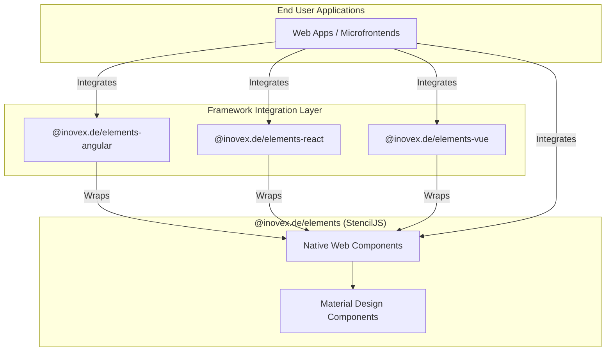

# High Level Overview

The goal of this high level overview is to provide you with a better understanding of what this mono repository contains and how things relate to each other.

## The Repository Structure

This is a mono repository based on Turborepo. Each package provides a separate README and is distributed as a self-contained package through npm. These packages are a thin layer on top of our Web Components to achieve a better framework integration.

| **Package**        | **Description**           | **Primary Usage Intention**                               |
| :----------------- | :------------------------ | :-------------------------------------------------------- |
| `elements`         | Native Web Components     | Websites, WebApps and Microfrontends without a framework. |
| `elements-angular` | Angular integration layer | WebApps based on Angular.                                 |
| `elements-react`   | React integration layer   | WebApps based on React.                                   |
| `elements-vue`     | Vue integration layer     | WebApps based on Vue.                                     |
| `storybook`        | Storybook documentation   | API reference and guide for developers.                   |
| `landingpage`      | Our elements landingpage  | For visitors interested in the inovex elements.           |

## Architecture Diagram

### Elements Core

This package contains our components written with [Stencil](https://stenciljs.com/) and wires up the code of [Googles Material Design Components for the Web](https://github.com/material-components/material-components-web/) (MDC) as our foundation layer as well as additional third party dependencies like [flatpickr](https://flatpickr.js.org/).

#### Stencil

Stencil is a compiler for building fast web apps using Web Components.
Stencil combines the best concepts of the most popular frontend frameworks into a compile-time rather than run-time tool. Stencil components are basic Web Components which makes them work in any major framework as well as completely on their own without any additional framework.

#### Google Material Design Components for the Web

We use [Googles Material Design Components for the Web](https://github.com/material-components/material-components-web/) to speed up the development. This is also a good foundation as the major functionality is already implemented. We often only need to tweak and change some bits to achieve the desired behaviour.

### Framework Integration Layers

The wrapper libraries (Angular, React, Vue) consume the core package and output framework-specific components.
Every time you run `pnpm build` from within the root of this repo, the core package builds before the wrapper libraries. This project only provides a wrapper component to map the Custom Elements attributes and events to the input bindings in the respective frameworks.

### Storybook

[Storybook](https://github.com/storybooks/storybook) is a development environment for UI components. It allows us to browse the inovex Elements, view the different states of each component, and interactively develop and test inovex components.
