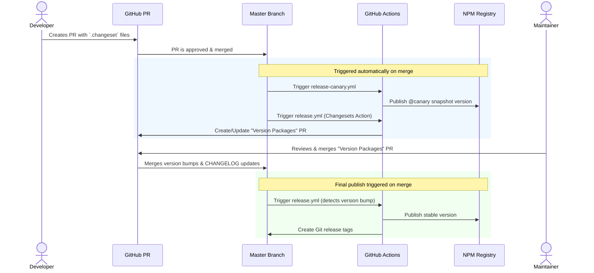

# Publishing & Versioning Guide

This guide explains how we handle versioning and publishing for `@inovex.de/elements` and its related packages.

We use [Changesets](https://github.com/changesets/changesets) to manage versioning and changelogs. The entire process is automated via GitHub Actions.

## 🚀 Overview

The publishing workflow consists of two main parts:

1.  **Canary Releases**: Every commit to `master` is automatically published as a snapshot version (e.g. `0.0.0-next-20231024093043`) to npm with the `canary` tag.
2.  **Stable Releases**: A "Version Packages" Pull Request is automatically created/updated by the Release Action. Merging this PR triggers the final publish to npm.

## 📝 For Developers: Creating a Changeset

When you make a change that should be released (feature, fix, or breaking change), you **must** include a changeset.

1.  **Run the CLI**:

    ```bash
    pnpm changeset
    ```

2.  **Select Packages**:
    Use arrow keys and confirm with space to select the packages you modified.

    - `@inovex.de/elements` and wrappers
    - Other workspace packages

    _Note: All packages are "fixed" together in `.changeset/config.json`. Bumping one will bump all of them to keep versions in sync._

3.  **Choose Version Bump**:

- **Major**: Breaking changes.
- **Minor**: New features.
- **Patch**: Bug fixes.

4.  **Write Summary**:
    Write a clear, user-facing description of your change. This will end up in the `CHANGELOG.md` file.

5.  **Commit**:
    The command will generate a markdown file in `.changeset/`. Commit this file along with your code changes.

```bash
git add .changeset/*.md
git commit -m "chore: add changeset"
```

---

## 🔄 Release Workflow (Automated)



### 1. Canary Releases (Snapshots)

Use the `canary` tag to test your changes immediately after merging to `master`, or use the **Check** workflow in your PR.

- **Trigger**: A Pull Request is merged into `master`.
- **Action**: `release-canary.yml`.
- **Result**: Publishes packages to npm with the `canary` tag (e.g. `npm install @inovex.de/elements@canary`).
- **Versioning**: Uses a snapshot version (e.g., `9.4.0-canary-20231025120000`).
- **Side Effects**: _No_ git tags are created, and `package.json` versions are _not_ committed back to the repo.

### 2. Stable Releases

This is the standard process for releasing official versions.

- **Trigger**: A Pull Request containing `.changeset` files is merged into `master`.
- **Action**: `release.yml` (Changesets Action).
- **Step 1: Versioning PR**:
  - The [Changesets Action](https://github.com/changesets/action) automatically opens (or updates) a Pull Request titled **"Version Packages"**.
  - This PR contains:
    - Updates to `package.json` versions.
    - Updates to `CHANGELOG.md` files.
    - Deletion of the consumed `.changeset/*.md` files.
- **Step 2: Publishing**:
  - **Review & Merge**: A maintainer reviews the "Version Packages" PR and merges it into `master`.
  - **Tag & Publish**: Upon merging, `release.yml` runs again, detects the version bump commit, builds the packages, and publishes them to npm.
  - **Git Tags**: Git tags (e.g., `@inovex.de/elements@10.0.0`) are created automatically.

---

## 🛠 Manual Actions

### Triggering a Release Manually

If the "Version Packages" PR is not created automatically or you need to force a release, you can run the `Release` workflow manually via the GitHub Actions tab.

1.  Go to **Actions** > **Release**.
2.  Click **Run workflow**.

## 📚 References

- [Changesets Documentation](https://github.com/changesets/changesets)
