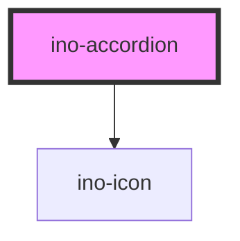

# ino-accordion

<!-- Auto Generated Below -->

## Properties

| Property         | Attribute         | Description                               | Type      | Default |
| ---------------- | ----------------- | ----------------------------------------- | --------- | ------- |
| `accordionTitle` | `accordion-title` | Sets the title for this element.          | `string`  | `null`  |
| `expanded`       | `expanded`        | Sets the expanded state for this element. | `boolean` | `false` |

## Events

| Event            | Description                                                                                                         | Type                   |
| ---------------- | ------------------------------------------------------------------------------------------------------------------- | ---------------------- |
| `expandedChange` | Emits when the user clicks on the icon toggle  to change the expanded state. Contains the status in `event.detail`. | `CustomEvent<boolean>` |

## Slots

| Slot        | Description              |
| ----------- | ------------------------ |
| `"default"` | content of the Accordion |

## Dependencies

### Depends on

- [ino-icon](../ino-icon)

### Graph

----------------------------------------------

*Built with [StencilJS](https://stenciljs.com/)*
