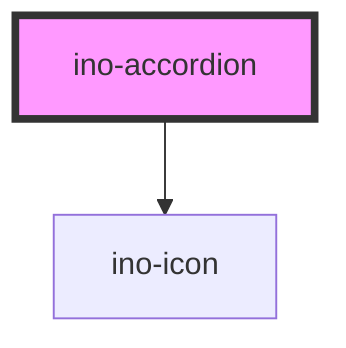

# ino-accordion

<!-- Auto Generated Below -->

## Properties

| Property         | Attribute         | Description | Type      | Default |
| ---------------- | ----------------- | ----------- | --------- | ------- |
| `accordionTitle` | `accordion-title` |             | `string`  | `null`  |
| `expanded`       | `expanded`        |             | `boolean` | `false` |

## Events

| Event            | Description | Type               |
| ---------------- | ----------- | ------------------ |
| `expandedChange` |             | `CustomEvent<any>` |

## Dependencies

### Depends on

- [ino-icon](../ino-icon)

### Graph

----------------------------------------------

*Built with [StencilJS](https://stenciljs.com/)*
