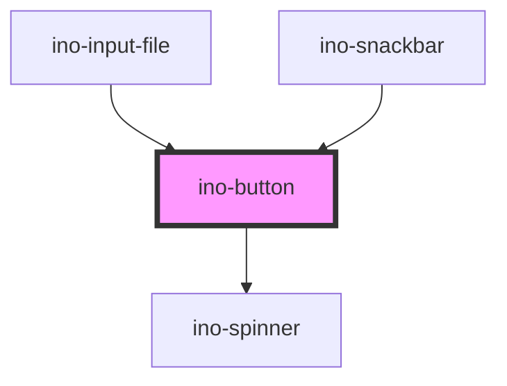

# ino-button

A button component with different styles and icon capability.

## Usage

The component can be used as follows:

### Web Component

```js
document
  .querySelector('ino-button')
  .addEventListener('click', _ => alert('Button was clicked!'));
```

```html
<ino-button
  autofocus
  disabled
  name="<string>"
  form="<string>"
  type="<string>"
  ino-color-scheme="<string>"
  ino-fill="<string>"
  ino-icon="<string>"
  ino-icon-prepend
  ino-dense
  onClick="handleClick()"
>
  Button Content
</ino-button>
```

### React

#### Example #1 - Basic

```js
import { Component } from 'react';
import { InoButton } from '@inovex/elements/dist/react';

class MyComponent extends Component {
  render() {
    return (
      <InoButton
        inoIcon="star"
        inoColorScheme="dark"
        onClick={_ => alert('Yeah, you clicked the button!')}
      >
        You can click me!
      </InoButton>
    );
  }
}
```

#### Example #2 - With Types

```js
import React, { Component } from 'react';
import { InoButton } from '@inovex/elements/dist/react';
import { Components } from '@inovex/elements/dist/types/components';

const Button: React.FunctionComponent<Components.InoButtonAttributes> = props => {
  const { inoIcon, inoColorScheme, onClick } = props;

  return (
    <InoButton
      inoIcon={inoIcon}
      inoColorScheme={inoColorScheme}
      onClick={onClick}
    >
      Button Text
    </InoButton>
  );
};

class MyComponent extends Component {
  render() {
    return (
      <Button
        inoIcon="star"
        inoColorScheme="dark"
        onClick={_ => alert('Yeah, you clicked the button!')}
      />
    );
  }
}
```

## Demo

<!-- Auto Generated Below -->


## Properties

| Property          | Attribute           | Description                                                                                                                                                                                                                                               | Type                                            | Default     |
| ----------------- | ------------------- | --------------------------------------------------------------------------------------------------------------------------------------------------------------------------------------------------------------------------------------------------------- | ----------------------------------------------- | ----------- |
| `autoFocus`       | `autofocus`         | Sets the autofocus for this element.                                                                                                                                                                                                                      | `boolean`                                       | `undefined` |
| `disabled`        | `disabled`          | Disables this element.                                                                                                                                                                                                                                    | `boolean`                                       | `undefined` |
| `form`            | `form`              | The form id this element origins to.                                                                                                                                                                                                                      | `string`                                        | `undefined` |
| `inoColorScheme`  | `ino-color-scheme`  | The name of the color scheme which is used to style the background and outline of this component. Possible values: `primary` (default),  `secondary`, `grey`, `white`. `white` and `grey` can only be used in combination with the `outline` fill-option! | `"grey" \| "primary" \| "secondary" \| "white"` | `'primary'` |
| `inoDense`        | `ino-dense`         | Makes the button text and container slightly smaller.                                                                                                                                                                                                     | `boolean`                                       | `false`     |
| `inoEdgeMirrored` | `ino-edge-mirrored` | Styles the button to have the edge on the top-right instead of the top-left                                                                                                                                                                               | `boolean`                                       | `false`     |
| `inoFill`         | `ino-fill`          | The fill type of this element. Possible values: `solid` (default), `outline`, `inverse`.                                                                                                                                                                  | `"inverse" \| "outline" \| "solid"`             | `'solid'`   |
| `inoFullWidth`    | `ino-full-width`    | Styles the button in 100% width.                                                                                                                                                                                                                          | `boolean`                                       | `false`     |
| `inoIconLeading`  | `ino-icon-leading`  | If enabled, prepends the slotted icon to the button label                                                                                                                                                                                                 | `boolean`                                       | `false`     |
| `inoIconTrailing` | `ino-icon-trailing` | If enabled, appends the slotted icon to the button label                                                                                                                                                                                                  | `boolean`                                       | `false`     |
| `inoLoading`      | `ino-loading`       | Shows an infinite loading spinner and prevents further clicks.                                                                                                                                                                                            | `boolean`                                       | `undefined` |
| `name`            | `name`              | The name of the element.                                                                                                                                                                                                                                  | `string`                                        | `undefined` |
| `type`            | `type`              | The type of this form.  Can either be `button`, `submit` or `reset`.                                                                                                                                                                                      | `"button" \| "reset" \| "submit"`               | `'button'`  |


## Dependencies

### Used by

 - [ino-input-file](../ino-input-file)
 - [ino-snackbar](../ino-snackbar)

### Depends on

- [ino-spinner](../ino-spinner)

### Graph


----------------------------------------------

*Built with [StencilJS](https://stenciljs.com/)*
