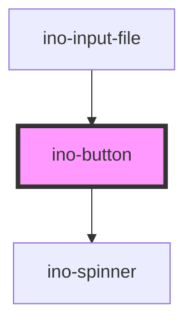

# ino-button

A button component with different styles and icon capability.

## Usage

The component can be used as follows:

### Web Component

```js
document
  .querySelector('ino-button')
  .addEventListener('click', (_) => alert('Button was clicked!'));
```

```html
<ino-button
  autofocus
  disabled
  name="<string>"
  form="<string>"
  type="<string>"
  color-scheme="<string>"
  fill="<string>"
  dense
  onClick="handleClick()"
>
  <ino-icon icon="add"></ino-icon>
  Button Content
</ino-button>
```

### React

#### Example #1 - Basic

```jsx
import { Component } from 'react';
import { InoButton, InoIcon } from '@inovex.de/elements/dist/react';

class MyComponent extends Component {
  render() {
    return (
      <InoButton
        inoColorScheme="dark"
        inoIconLeading
        onClick={(_) => alert('Yeah, you clicked the button!')}
      >
        <InoIcon inoIcon="add" />
        You can click me!
      </InoButton>
    );
  }
}
```

#### Example #2 - With Types

```js
import React, { Component } from 'react';
import { InoButton } from '@inovex.de/elements/dist/react';
import { Components } from '@inovex.de/elements/dist/types/components';

const Button: React.FunctionComponent<Components.InoButtonAttributes> = (
  props,
) => {
  const { inoColorScheme, onClick } = props;

  return (
    <InoButton inoColorScheme={inoColorScheme} inoIconLeading onClick={onClick}>
      <InoIcon inoIcon={'add'} />
      You can click me!
    </InoButton>
  );
};

class MyComponent extends Component {
  render() {
    return (
      <Button
        inoColorScheme="dark"
        onClick={(_) => alert('Yeah, you clicked the button!')}
      />
    );
  }
}
```

## Demo

<!-- Auto Generated Below -->


## Properties

| Property    | Attribute   | Description                                                                              | Type                               | Default     |
| ----------- | ----------- | ---------------------------------------------------------------------------------------- | ---------------------------------- | ----------- |
| `autoFocus` | `autofocus` | Sets the autofocus for this element.                                                     | `boolean`                          | `undefined` |
| `dense`     | `dense`     | Makes the button text and container slightly smaller.                                    | `boolean`                          | `false`     |
| `disabled`  | `disabled`  | Disables this element.                                                                   | `boolean`                          | `undefined` |
| `fill`      | `fill`      | The fill type of this element. Possible values: `solid` (default), `outline`, `inverse`. | `"filled" \| "outlined" \| "text"` | `'filled'`  |
| `form`      | `form`      | The form id this element origins to.                                                     | `string`                           | `undefined` |
| `loading`   | `loading`   | Shows an infinite loading spinner and prevents further clicks.                           | `boolean`                          | `undefined` |
| `name`      | `name`      | The name of the element.                                                                 | `string`                           | `undefined` |
| `type`      | `type`      | The type of this form.  Can either be `button`, `submit` or `reset`.                     | `"button" \| "reset" \| "submit"`  | `'button'`  |


## Slots

| Slot              | Description                  |
| ----------------- | ---------------------------- |
| `"icon-leading"`  | For the icon to be prepended |
| `"icon-trailing"` | For the icon to be appended  |


## Dependencies

### Used by

 - [ino-input-file](../ino-input-file)

### Depends on

- [ino-spinner](../ino-spinner)

### Graph


----------------------------------------------

*Built with [StencilJS](https://stenciljs.com/)*
