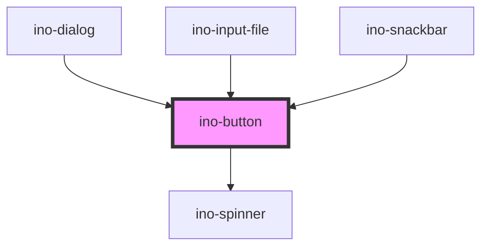

# ino-button

<!-- Auto Generated Below -->

## Overview

A button component with different styles and icon capability.

## Properties

| Property    | Attribute   | Description                                                                                                                                                                                                                                                                                                               | Type                               | Default     |
| ----------- | ----------- | ------------------------------------------------------------------------------------------------------------------------------------------------------------------------------------------------------------------------------------------------------------------------------------------------------------------------- | ---------------------------------- | ----------- |
| `autoFocus` | `autofocus` | Sets the autofocus for this element.                                                                                                                                                                                                                                                                                      | `boolean`                          | `undefined` |
| `dense`     | `dense`     | Makes the button text and container slightly smaller.                                                                                                                                                                                                                                                                     | `boolean`                          | `false`     |
| `disabled`  | `disabled`  | Disables this element.                                                                                                                                                                                                                                                                                                    | `boolean`                          | `undefined` |
| `form`      | `form`      | The form id this element origins to.                                                                                                                                                                                                                                                                                      | `string`                           | `undefined` |
| `loading`   | `loading`   | Shows an infinite loading spinner and prevents further clicks.                                                                                                                                                                                                                                                            | `boolean`                          | `undefined` |
| `name`      | `name`      | The name of the element.                                                                                                                                                                                                                                                                                                  | `string`                           | `undefined` |
| `type`      | `type`      | The type of this form.  Can either be `button`, `submit` or `reset`.                                                                                                                                                                                                                                                      | `"button" \| "reset" \| "submit"`  | `'button'`  |
| `variant`   | `variant`   | The button variant.  * **filled**: Contain actions that are important for your application. * **outlined**: Buttons with medium highlighting. They contain actions that are important but are not the main action in an app. * **text**: Typically used for less prominent actions, including those in dialogs and cards. | `"filled" \| "outlined" \| "text"` | `'filled'`  |

## Slots

| Slot              | Description                  |
| ----------------- | ---------------------------- |
| `"icon-leading"`  | For the icon to be prepended |
| `"icon-trailing"` | For the icon to be appended  |

## Dependencies

### Used by

 - [ino-dialog](../ino-dialog)
 - [ino-input-file](../ino-input-file)
 - [ino-snackbar](../ino-snackbar)

### Depends on

- [ino-spinner](../ino-spinner)

### Graph

----------------------------------------------

*Built with [StencilJS](https://stenciljs.com/)*
