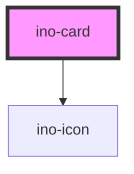

# ino-card

<!-- Auto Generated Below -->

## Properties

| Property           | Attribute           | Description                                                        | Type      | Default |
| ------------------ | ------------------- | ------------------------------------------------------------------ | --------- | ------- |
| `disableElevation` | `disable-elevation` | Disables the hover effect if true                                  | `boolean` | `false` |
| `selected`         | `selected`          | Selects the card and displays a check mark icon on top of the card | `boolean` | `false` |

## Slots

| Slot        | Description                                                                                                                                                                                                          |
| ----------- | -------------------------------------------------------------------------------------------------------------------------------------------------------------------------------------------------------------------- |
| `"content"` | For card content                                                                                                                                                                                                     |
| `"footer"`  | For the element to be placed in the card footer  The ino-card is a flexible and extensible component. It features a header, content, and footer slot that can be used to fully customize the appearance of the card. |
| `"header"`  | For the element to be placed in the card header                                                                                                                                                                      |

## Dependencies

### Depends on

- [ino-icon](../ino-icon)

### Graph

----------------------------------------------

*Built with [StencilJS](https://stenciljs.com/)*
