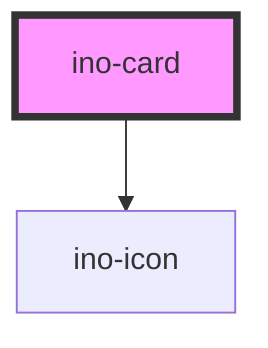

# ino-card

<!-- Auto Generated Below -->

## Overview

The ino-card is a flexible and extensible component. It features a header, content, and footer slot that can be used to
fully customize the appearance of the card.

## Properties

| Property           | Attribute           | Description                                                        | Type      | Default |
| ------------------ | ------------------- | ------------------------------------------------------------------ | --------- | ------- |
| `disableElevation` | `disable-elevation` | Disables the hover effect if true                                  | `boolean` | `false` |
| `selected`         | `selected`          | Selects the card and displays a check mark icon on top of the card | `boolean` | `false` |

## Slots

| Slot        | Description                                     |
| ----------- | ----------------------------------------------- |
| `"content"` | For card content                                |
| `"footer"`  | For the element to be placed in the card footer |
| `"header"`  | For the element to be placed in the card header |

## CSS Custom Properties

| Name                                    | Description                                          |
| --------------------------------------- | ---------------------------------------------------- |
| `--ino-card-background-color`           | Background color of the card. [color:#fff]           |
| `--ino-card-background-color--active`   | Background color of the card if active. [color:#fff] |
| `--ino-card-background-color--focus`    | Background color of the card on focus. [color:#fff]  |
| `--ino-card-background-color--hover`    | Background color of the card on hover. [color:#fff]  |
| `--ino-card-border-color`               | Border color of the card. [color:#c1c1c1]            |
| `--ino-card-border-thickness`           | Thickness of the border. [size:1]                    |
| `--ino-card-checkmark-background-color` | Background Color of the check mark. [color:#fff]     |
| `--ino-card-checkmark-color`            | Check mark color. [color:#3d40f5]                    |

## Dependencies

### Depends on

- [ino-icon](../ino-icon)

### Graph

----------------------------------------------

*Built with [StencilJS](https://stenciljs.com/)*
