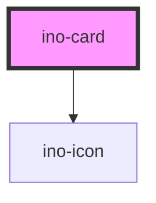

# ino-card

The ino-card is a flexible and extensible component. It features a header, content, and footer slot that can be used to
fully customize the appearance of the card.

## Usage

The component can be used as follows:

### Web Component

```js
document
  .querySelector('ino-card')
  .addEventListener('click', (_) => alert('Card was clicked!'));
```

```html
<ino-card selected="<boolean>" disable-elevation="<boolean>">
  <div slot="header"><!-- Any content --></div>
  <div slot="content"><!-- Any content --></div>
  <div slot="footer"><!-- Any content --></div>
</ino-card>
```

### React

```js
import { Component } from 'react';
import { InoCard, InoButton, InoImg } from '@inovex.de/elements/dist/react';

class MyComponent extends Component {
  render() {
    return (
      <InoCard inoDisableElevation>
        <div class="my-card__header" slot="header">
          <h1>My awesome card</h1>
        <div/>
        <div class="my-card__content" slot="content">
          <InoImg src="assets/picture_of_me.png"></InoImg>
        </div>
        <div class="my-card__footer" slot="footer">
          <InoButton>Send Email</InoButton>
        </div>
      </InoCard>
    );
  }
}
```

<!-- Auto Generated Below -->


## Properties

| Property           | Attribute           | Description                                                        | Type      | Default |
| ------------------ | ------------------- | ------------------------------------------------------------------ | --------- | ------- |
| `disableElevation` | `disable-elevation` | Disables the hover effect if true                                  | `boolean` | `false` |
| `selected`         | `selected`          | Selects the card and displays a check mark icon on top of the card | `boolean` | `false` |


## Slots

| Slot        | Description                                     |
| ----------- | ----------------------------------------------- |
| `"content"` | For card content                                |
| `"footer"`  | For the element to be placed in the card footer |
| `"header"`  | For the element to be placed in the card header |


## CSS Custom Properties

| Name                          | Description                        |
| ----------------------------- | ---------------------------------- |
| `--ino-card-background-color` | background color of the check mark |
| `--ino-card-color`            | check mark color                   |


## Dependencies

### Depends on

- [ino-icon](../ino-icon)

### Graph


----------------------------------------------

*Built with [StencilJS](https://stenciljs.com/)*
