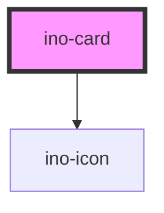

# ino-card

A card is as flexible and extensible content component. So far, the card is a simple content component with title and subtitle.

## Usage

The component can be used as follows:

### Web Component

```js
document
  .querySelector('ino-card')
  .addEventListener('click', _ => alert('Card was clicked!'));
```

```html
<ino-card
  ino-subtitle="<string>"
  ino-title="<string>"
  ino-outline
  ino-image="<string>"
  ino-aspect-ratio="<string>"
  ino-media-title
  ino-color-scheme
  onClick="handleClick()"
>
  <div slot="content"><!-- Any content --></div>
  <ino-button slot="action-buttons" ino-fill="transparent">Read</ino-button>
  <ino-button slot="action-buttons" ...>Bookmark</ino-button>
  <ino-icon-button slot="action-icons" ...></ino-icon-button>
  <ino-icon-button slot="action-icons" ...></ino-icon-button>
  <ino-icon-button slot="action-icons" ...></ino-icon-button>
</ino-card>
```

### React

#### Example #1 - Basic

```js
import { Component } from 'react';
import { InoCard } from '@inovex/elements/dist/react';

class MyComponent extends Component {
  render() {
    return (
      <InoCard inoTitle="The awesome card!">
        <div slot="content">It's simple to use this component.</div>
        <InoButton slot="action-buttons" ino-fill="transparent">
          Accept
        </InoButton>
        <InoButton slot="action-buttons">Dismiss</InoButton>
      </InoCard>
    );
  }
}
```

#### Example #2 - With Types

```js
import React, { Component } from 'react';
import { InoButton, InoCard } from '@inovex/elements/dist/react';
import { Components } from '@inovex/elements/dist/types/components';

const Card: React.FunctionComponent<Components.InoCardAttributes> = props => {
  const { inoTitle, inoSubtitle } = props;

  return (
    <InoCard inoTitle={inoTitle} inoSubtitle={inoSubtitle}>
      {props.children}
    </InoCard>
  );
};

class MyComponent extends Component {
  render() {
    return (
      <Card inoTitle="Eat apples!" inoSubtitle="They're so healthy">
        <div slot="content">We should add an apple image here.</div>
        <InoButton slot="action-buttons" ino-fill="transparent">
          Accept
        </InoButton>
        <InoButton slot="action-buttons">Dismiss</InoButton>
      </Card>
    );
  }
}
```

## Demo

<!-- Auto Generated Below -->


## Properties

| Property      | Attribute      | Description                                                        | Type      | Default |
| ------------- | -------------- | ------------------------------------------------------------------ | --------- | ------- |
| `inoSelected` | `ino-selected` | Selects the card and displays a check mark icon on top of the card | `boolean` | `false` |


## CSS Custom Properties

| Name                          | Description                        |
| ----------------------------- | ---------------------------------- |
| `--ino-card-background-color` | background color of the check mark |
| `--ino-card-color`            | check mark color                   |


## Dependencies

### Depends on

- [ino-icon](../ino-icon)

### Graph


----------------------------------------------

*Built with [StencilJS](https://stenciljs.com/)*
