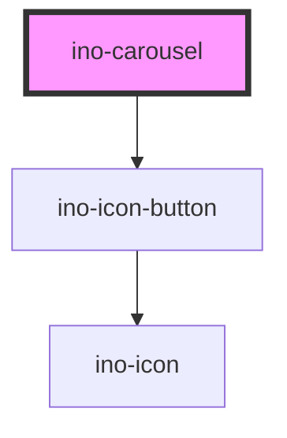

# ino-carousel

The ino-carousel component works in combination with the ino-carousel-slide component
and can be used to display an array of images as a slide show. What is more,
it also features an autoplay property that allows the slides to be changed automatically.

## Usage

The component can be used as follows:
```html
<ino-carousel 
    value="0"
    ino-autoplay="true"
    ino-disable-animation="true"
    ino-hide-buttons="false"
    ino-infinite="true"
    ino-interlude-duration="5000"
    ino-reverse-playback="false"
>
    <ino-carousel-slide value="0"></ino-carousel-slide>
    <ino-carousel-slide value="1"></ino-carousel-slide>
    <ino-carousel-slide value="2"></ino-carousel-slide>
</ino-carousel>
```


<!-- Auto Generated Below -->


## Properties

| Property          | Attribute          | Description                                                         | Type      | Default     |
| ----------------- | ------------------ | ------------------------------------------------------------------- | --------- | ----------- |
| `inoAnimated`     | `ino-animated`     | Disables the slide animation                                        | `boolean` | `false`     |
| `inoAutoplay`     | `ino-autoplay`     | Enables autoplay which causes slides to be changed automatically    | `boolean` | `false`     |
| `inoHideButtons`  | `ino-hide-buttons` | Hides the arrow buttons                                             | `boolean` | `false`     |
| `inoInfinite`     | `ino-infinite`     | Restarts playback from the first slide upon reaching the last slide | `boolean` | `false`     |
| `inoIntermission` | `ino-intermission` | Sets the intermission between two slides (Unit: ms)                 | `number`  | `5000`      |
| `inoReverse`      | `ino-reverse`      | Enables reverse playback of the slides                              | `boolean` | `false`     |
| `value`           | `value`            | Optional group value to manually manage the displayed slide         | `any`     | `undefined` |


## Dependencies

### Depends on

- [ino-icon-button](../ino-icon-button)

### Graph


----------------------------------------------

*Built with [StencilJS](https://stenciljs.com/)*
