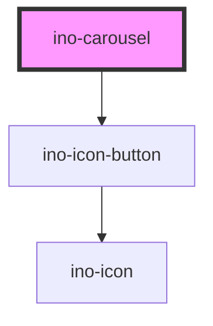

# ino-carousel

The `ino-carousel` component works in combination with the `ino-carousel-slide` component
and can be used to display an array of images as a slide show. What is more,
it also features an autoplay property that allows the slides to be changed automatically.
Lastly, using the css variables described at the bottom of the page, you can easily customize
the dimensions of the component as well as the duration of the slide transition.

## Usage

To change the slide that is currently displayed, simply set the value of the `ino-carousel`
component to the value of the corresponding slide. This is, however, not required if autoplay is
enabled since the component automatically manages the selection of the next slide.

Please be aware that setting the value of the `ino-carousel` to a non-existent value will result
in the component selecting an existing slide on its own.

The component can be used as follows:

```html
<ino-carousel
  value="<any value>"
  ino-autoplay="true"
  ino-animated="true"
  ino-hide-buttons="false"
  ino-infinite="true"
  ino-intermission="5000"
  ino-reverse="false"
>
  <ino-carousel-slide value="0" src="<url>"></ino-carousel-slide>
  <ino-carousel-slide value="1" src="<url>"></ino-carousel-slide>
  <ino-carousel-slide value="2" src="<url>"></ino-carousel-slide>
</ino-carousel>
```

```jsx harmony
import { Component } from 'react';
import {
  InoButton,
  InoCarousel,
  InoCarouselSlide,
} from '@inovex/elements/dist/react';
import React from 'react';

class MyComponent extends Component {
  state = {
    autoplay: false,
  };

  handleClick = () => {
    this.setState((state) => ({
      autoplay: !state.autoplay,
    }));
  };

  render() {
    return (
      <InoCarousel inoAutoplay={this.state.autoplay}>
        <InoButton onClick={() => this.handleClick()}>
          Start/Stop Slideshow
        </InoButton>
        <InoCarouselSlide value={'1'} src={'url'} />
        <InoCarouselSlide value={'2'} src={'url'} />
      </InoCarousel>
    );
  }
}
```

<!-- Auto Generated Below -->


## Properties

| Property          | Attribute          | Description                                                         | Type      | Default     |
| ----------------- | ------------------ | ------------------------------------------------------------------- | --------- | ----------- |
| `inoAnimated`     | `ino-animated`     | Enables the slide animation                                         | `boolean` | `false`     |
| `inoAutoplay`     | `ino-autoplay`     | Enables autoplay which causes slides to be changed automatically    | `boolean` | `false`     |
| `inoHideButtons`  | `ino-hide-buttons` | Hides the arrow buttons                                             | `boolean` | `false`     |
| `inoInfinite`     | `ino-infinite`     | Restarts playback from the first slide upon reaching the last slide | `boolean` | `false`     |
| `inoIntermission` | `ino-intermission` | Sets the intermission between two slides (Unit: ms)                 | `number`  | `5000`      |
| `inoReverse`      | `ino-reverse`      | Enables reverse playback of the slides                              | `boolean` | `false`     |
| `value`           | `value`            | Optional group value to manually manage the displayed slide         | `any`     | `undefined` |


## Dependencies

### Depends on

- [ino-icon-button](../ino-icon-button)

### Graph


----------------------------------------------

*Built with [StencilJS](https://stenciljs.com/)*
