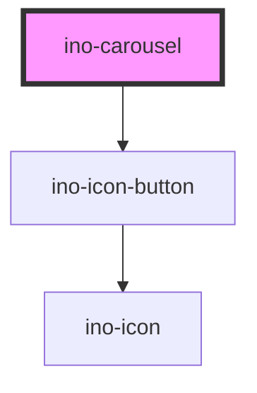

# ino-carousel

<!-- Auto Generated Below -->

## Properties

| Property               | Attribute                | Description                                                         | Type      | Default     |
| ---------------------- | ------------------------ | ------------------------------------------------------------------- | --------- | ----------- |
| `inoAnimationDuration` | `ino-animation-duration` | Sets the duration of the slide animation                            | `number`  | `500`       |
| `inoAutoplay`          | `ino-autoplay`           | Enables autoplay which causes slides to be changed automatically    | `boolean` | `false`     |
| `inoDisableAnimation`  | `ino-disable-animation`  | Disables the slide animation                                        | `boolean` | `false`     |
| `inoInfinite`          | `ino-infinite`           | Restarts playback from the first slide upon reaching the last slide | `boolean` | `false`     |
| `inoInterludeDuration` | `ino-interlude-duration` | Sets the intermission between two slides (Unit: ms)                 | `number`  | `5000`      |
| `value`                | `value`                  | Sets the current value of the carousel                              | `number`  | `undefined` |

## Dependencies

### Depends on

- [ino-icon-button](../ino-icon-button)

### Graph

----------------------------------------------

*Built with [StencilJS](https://stenciljs.com/)*
