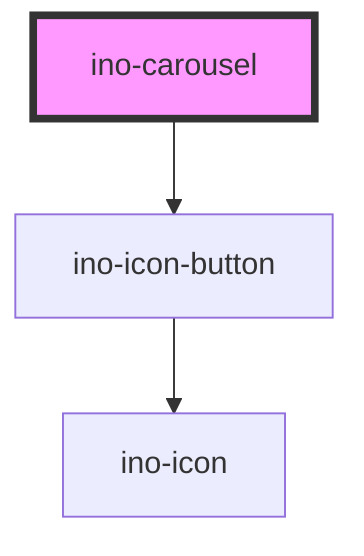

# ino-carousel

<!-- Auto Generated Below -->

## Overview

The `ino-carousel` component works in combination with the `ino-carousel-slide` component
and can be used to display an array of images as a slide show. What is more,
it also features an autoplay property that allows the slides to be changed automatically.
Lastly, using the css variables described at the bottom of the page, you can easily customize
the dimensions of the component as well as the duration of the slide transition.

## Properties

| Property             | Attribute      | Description                                                                                         | Type      | Default     |
| -------------------- | -------------- | --------------------------------------------------------------------------------------------------- | --------- | ----------- |
| `autoplay`           | `autoplay`     | Enables autoplay which causes slides to be changed automatically after `intermission` milliseconds. | `boolean` | `false`     |
| `hideButtons`        | `hide-buttons` | Hides the arrow buttons                                                                             | `boolean` | `false`     |
| `infinite`           | `infinite`     | Restarts playback from the first slide upon reaching the last slide                                 | `boolean` | `true`      |
| `intermission`       | `intermission` | Sets the intermission between two slides (Unit: ms)                                                 | `number`  | `5000`      |
| `reverse`            | `reverse`      | Enables reverse playback of the slides                                                              | `boolean` | `false`     |
| `value` _(required)_ | `value`        | `value` of the slide that should be displayed.                                                      | `string`  | `undefined` |

## Events

| Event         | Description                                                                                     | Type                  |
| ------------- | ----------------------------------------------------------------------------------------------- | --------------------- |
| `valueChange` | Emits the `value` of the slide that should be displayed after interaction or autoplay interval. | `CustomEvent<string>` |

## Slots

| Slot        | Description                      |
| ----------- | -------------------------------- |
| `"default"` | One or more `ino-carousel-slide` |

## CSS Custom Properties

| Name                                | Description                              |
| ----------------------------------- | ---------------------------------------- |
| `--ino-carousel-animation-duration` | sets the duration of the slide animation |
| `--ino-carousel-icon-color`         | sets the color of the navigation buttons |

## Dependencies

### Depends on

- [ino-icon-button](../ino-icon-button)

### Graph

----------------------------------------------

*Built with [StencilJS](https://stenciljs.com/)*
