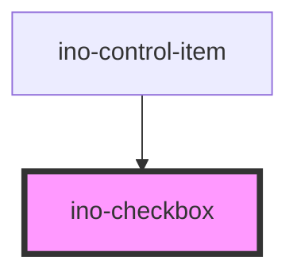

# ino-checkbox

A checkbox that allows the user to select one or more items from a set of options.

## Usage

The component can be used as follows:

### Web Component

```js
document
  .querySelector('ino-checkbox')
  .addEventListener('checkedChange', (e) =>
    alert(`The checked state is: ${e.detail}`),
  );
```

```html
<ino-checkbox
  checked
  disabled
  name="<string>"
  value="<string>"
  indeterminate
  id="<string>"
  tab-index="<number>"
>
  Label
</ino-checkbox>
```

### React

#### Example #1 - Basic

```js
import { Component } from 'react';
import { InoCheckbox } from '@inovex.de/elements/dist/react';

class MyComponent extends Component {
  state = {
    checked: false,
  };

  handleCheckboxClick() {
    this.setState({ checked: !this.state.checked });
  }

  render() {
    return (
      <InoCheckbox
        value="Apple"
        onClick={(_) => this.handleCheckboxClick()}
        checked={this.state.checked}
      >
        Apple
      </InoCheckbox>
    );
  }
}
```

#### Example #2 - With Types

```js
import React, { Component } from 'react';
import { InoCheckbox } from '@inovex.de/elements/dist/react';
import { Components } from '@inovex.de/elements/dist/types/components';

const Checkbox: React.FunctionComponent<Components.InoCheckboxAttributes> = (
  props,
) => {
  const { value, onClick, checked } = props;

  return (
    <InoCheckbox value={value} onClick={onClick} checked={checked}>
      {value}
    </InoCheckbox>
  );
};

class MyComponent extends Component {
  state = {
    checked: false,
  };

  handleCheckboxClick() {
    this.setState({ checked: !this.state.checked });
  }

  render() {
    return (
      <Checkbox
        value="Apple"
        onClick={(_) => this.handleCheckboxClick()}
        checked={this.state.checked}
      >
        Apple
      </Checkbox>
    );
  }
}
```

## Additional Hints

By default, the label is always shown on the right side of the checkbox.

**Indeterminate:** The indeterminate status is set by the user. It indicates that a user is indeterminate without changing the checked state. If a checkbox is unchecked and indeterminate then it will lose the indeterminate state on click and change to checked. [Documentation on MDN](https://developer.mozilla.org/en-US/docs/Web/HTML/Element/input/checkbox#Indeterminate_state_checkboxes)

**Selection:** Checkboxes are mainly used in lists. Selection should be used as single, stand-alone UI element. The indeterminate state is not supported.

## Control flow

The input has a controlled (unmanaged) attribute `checked` and `indeterminate`. For this reason, listen to `checkedChange`, sync it with your local state and pass the new value to the component again to change value and indeterminate state of input:

## Demo

<!-- Auto Generated Below -->


## Properties

| Property        | Attribute       | Description                                                                                                                                                                                                                      | Type      | Default     |
| --------------- | --------------- | -------------------------------------------------------------------------------------------------------------------------------------------------------------------------------------------------------------------------------- | --------- | ----------- |
| `checked`       | `checked`       | Marks this element as checked. (**unmanaged**)                                                                                                                                                                                   | `boolean` | `false`     |
| `disabled`      | `disabled`      | Disables this element.                                                                                                                                                                                                           | `boolean` | `undefined` |
| `indeterminate` | `indeterminate` | Marks this element as indeterminate (**unmanaged**)                                                                                                                                                                              | `boolean` | `undefined` |
| `name`          | `name`          | The name of this element.                                                                                                                                                                                                        | `string`  | `undefined` |
| `selection`     | `selection`     | Styles the checkbox as a selection variant that has a larger radius. While checkboxes are mainly used in lists, the selection should be used as a single, independent UI element. The indeterminate state is not supported here. | `boolean` | `undefined` |
| `value`         | `value`         | The value of this element.                                                                                                                                                                                                       | `string`  | `undefined` |


## Events

| Event           | Description                                                                                                    | Type               |
| --------------- | -------------------------------------------------------------------------------------------------------------- | ------------------ |
| `checkedChange` | Emits when the user clicks on the checkbox to change the checked state. Contains the status in `event.detail`. | `CustomEvent<any>` |


## Slots

| Slot        | Description           |
| ----------- | --------------------- |
| `"default"` | Label of the checkbox |


## CSS Custom Properties

| Name                                       | Description                                  |
| ------------------------------------------ | -------------------------------------------- |
| `--checkbox-container-color-unchecked`     | color of the checkbox container if unchecked |
| `--ino-checkbox-background-color-disabled` | color of the checkbox background if disabled |
| `--ino-checkbox-checkmark-color`           | primary color of the check mark              |
| `--ino-checkbox-checkmark-color-disabled`  | color of the check mark if disabled          |
| `--ino-checkbox-color`                     | primary color of the checkbox                |
| `--ino-checkbox-color-active`              | color of the checkbox if active              |
| `--ino-checkbox-color-hover`               | color of the checkbox on hover               |
| `--ino-checkbox-text-color-disabled`       | color of the checkbox text if disabled       |


## Dependencies

### Used by

 - [ino-control-item](../ino-control-item)

### Graph


----------------------------------------------

*Built with [StencilJS](https://stenciljs.com/)*
