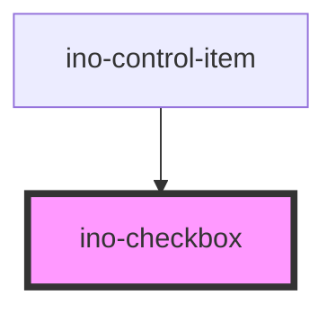

# ino-checkbox

<!-- Auto Generated Below -->

## Overview

An image that is shown in the `<ino-carousel>` component. Should only be used in conjunction with it.

## Properties

| Property               | Attribute                | Description                                                                                                                                                                                                                                                                                                                                                                                          | Type      | Default     |
| ---------------------- | ------------------------ | ---------------------------------------------------------------------------------------------------------------------------------------------------------------------------------------------------------------------------------------------------------------------------------------------------------------------------------------------------------------------------------------------------- | --------- | ----------- |
| `checked`              | `checked`                | Marks this element as checked. (**unmanaged**)                                                                                                                                                                                                                                                                                                                                                       | `boolean` | `false`     |
| `disabled`             | `disabled`               | Disables this element.                                                                                                                                                                                                                                                                                                                                                                               | `boolean` | `undefined` |
| `error`                | `error`                  | Displays the checkbox as invalid if set to true. This functionality might be useful if the input validation is (additionally) handled by the backend.                                                                                                                                                                                                                                                | `boolean` | `undefined` |
| `helperText`           | `helper-text`            | The optional helper text.                                                                                                                                                                                                                                                                                                                                                                            | `string`  | `undefined` |
| `helperTextPersistent` | `helper-text-persistent` | Displays the helper permanently.                                                                                                                                                                                                                                                                                                                                                                     | `boolean` | `undefined` |
| `helperTextValidation` | `helper-text-validation` | Styles the helper text as a validation message.                                                                                                                                                                                                                                                                                                                                                      | `boolean` | `undefined` |
| `indeterminate`        | `indeterminate`          | Marks this element as indeterminate. It indicates that a user is indeterminate without changing the checked state. If a checkbox is unchecked and indeterminate then it will lose the indeterminate state on click and change to checked. For more information, see [Documentation on MDN](https://developer.mozilla.org/en-US/docs/Web/HTML/Element/input/checkbox#Indeterminate_state_checkboxes). | `boolean` | `undefined` |
| `label`                | `label`                  | The label of this checkbox.                                                                                                                                                                                                                                                                                                                                                                          | `string`  | `undefined` |
| `name`                 | `name`                   | The name of this element.                                                                                                                                                                                                                                                                                                                                                                            | `string`  | `undefined` |
| `required`             | `required`               | Marks this element as required.                                                                                                                                                                                                                                                                                                                                                                      | `boolean` | `undefined` |
| `selection`            | `selection`              | Styles the checkbox as a selection variant that has a larger radius. While checkboxes are mainly used in lists, the selection should be used as a single, independent UI element. The indeterminate state is not supported here.                                                                                                                                                                     | `boolean` | `undefined` |
| `showLabelHint`        | `show-label-hint`        | If true, an *optional* message is displayed if not required, otherwise a * marker is displayed if required                                                                                                                                                                                                                                                                                           | `boolean` | `undefined` |
| `value`                | `value`                  | The value of this element.                                                                                                                                                                                                                                                                                                                                                                           | `string`  | `undefined` |

## Events

| Event           | Description                                                                                                    | Type               |
| --------------- | -------------------------------------------------------------------------------------------------------------- | ------------------ |
| `checkedChange` | Emits when the user clicks on the checkbox to change the checked state. Contains the status in `event.detail`. | `CustomEvent<any>` |

## Methods

### `setBlur() => Promise<void>`

Sets blur on the native `input`.
Use this method instead of the global `input.blur()`.

#### Returns

Type: `Promise<void>`

### `setFocus() => Promise<void>`

Sets focus on the native `input`.
Use this method instead of the global `input.focus()`.

#### Returns

Type: `Promise<void>`

## Slots

| Slot        | Description           |
| ----------- | --------------------- |
| `"default"` | Label of the checkbox |

## Dependencies

### Used by

 - [ino-control-item](../ino-control-item)

### Graph

----------------------------------------------

*Built with [StencilJS](https://stenciljs.com/)*
