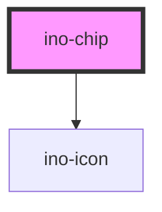

# ino-chip

The ino-chip component displays the provided content and icon as a chip.

> An ino-chip component must **always** belong to a `ino-chip-set` component.

## Usage

The component can be used as follows:

### Web Component

```js
document
  .querySelector('ino-chip')
  .addEventListener('removeChip', (e) =>
    console.log('This chip will be removed', e.detail),
  );
```

```html
<ino-chip
  color-scheme="<string>"
  fill="<string>"
  label="<string>"
  icon-leading
  removable
  selectable
  selected
  value="<string>"
>
  <ino-icon slot= icon-leading" icon="<string>"></ino-icon>
</ino-chip>
```

### React

#### Example #1 - Basic

```js
import { Component } from 'react';
import { InoChipSet, InoChip } from '@inovex.de/elements/dist/react';

class MyComponent extends Component {
  chipsetSelectionChange(e: any) {
    console.log(
      e.detail === true
        ? 'The last one was toggled'
        : `User clicked: ${e.detail}`,
    );
  }

  render() {
    return (
      <InoChipSet
        type="choice"
        onUpdateChipSet={this.chipsetSelectionChange}
      >
        <InoChip value="apple" label="Apple" />
        <InoChip value="banana" label="Banana" />
        <InoChip value="cherry" label="Cherry" />
      </InoChipSet>
    );
  }
}
```

#### Example #2 - With Types

```js
import React, { Component } from 'react';
import { InoChipSet, InoChip } from '@inovex.de/elements/dist/react';
import { Components } from '@inovex.de/elements/dist/types/components';

const ChipSet: React.FunctionComponent<Components.InoChipSetAttributes> = (
  props,
) => {
  const { type } = props;

  const chipsetSelectionChange = (e: any) => {
    console.log(
      e.detail === true
        ? 'The last one was toggled'
        : `User clicked: ${e.detail}`,
    );
  };

  return (
    <InoChipSet type={inoType} onUpdateChipSet={chipsetSelectionChange}>
      <InoChip value="apple" label="Apple" />
      <InoChip value="banana" label="Banana" />
      <InoChip value="cherry" label="Cherry" />
    </InoChipSet>
  );
};

class MyComponent extends Component {
  render() {
    return <ChipSet type="choice" />;
  }
}
```

## Additional Hints

**Content**: Use the  label` attribute to set the label of the chip. To add an icon to the left side of the chip, use the  icon` attribute.

**Styling**: The chip can be styled in many ways with the help of the `fill` and `color-scheme` attributes.
Take a look at the attribute documentation at the bottom of the page for further information.

### Removable chips

If `removable` is set to `true`, the chip can be removed by the user. The component then displays a small `close` icon on the right side of the chip next to the label.

However, the component will not be hidden or destroyed but instead emits a `removeChip`-Event. Thus, the component can be removed by subscribing to the corresponding event.

## Demo

<!-- Auto Generated Below -->


## Properties

| Property      | Attribute      | Description                                                                                                  | Type                                                                                              | Default     |
| ------------- | -------------- | ------------------------------------------------------------------------------------------------------------ | ------------------------------------------------------------------------------------------------- | ----------- |
| `colorScheme` | `color-scheme` | The name of the color scheme which is used to style the background and outline of this component.            | `"dark" \| "default" \| "error" \| "light" \| "primary" \| "secondary" \| "success" \| "warning"` | `'default'` |
| `disabled`    | `disabled`     |                                                                                                              | `boolean`                                                                                         | `false`     |
| `fill`        | `fill`         | The fill type of this element.                                                                               | `"outline" \| "solid"`                                                                            | `'solid'`   |
| `label`       | `label`        | The label of this chip (**required**).                                                                       | `string`                                                                                          | `undefined` |
| `removable`   | `removable`    | Adds a close icon on the right side of this chip.  If applied, emits the `removeChip` event on remove click. | `boolean`                                                                                         | `false`     |
| `selectable`  | `selectable`   | Makes the chip selectable. Will be set by the `<ino-chip-set>`.                                              | `boolean`                                                                                         | `false`     |
| `selected`    | `selected`     | Marks this element as selected.                                                                              | `boolean`                                                                                         | `false`     |
| `value`       | `value`        | The value of this chip.  **Required** for chips as part of sets of type `filter` or `choice`.                | `string`                                                                                          | `undefined` |


## Events

| Event        | Description                                                                                                                                                           | Type               |
| ------------ | --------------------------------------------------------------------------------------------------------------------------------------------------------------------- | ------------------ |
| `removeChip` | Event that emits as soon as the user removes this chip.  Listen to this event to hide or destroy this chip. The event only emits if the property `removable` is true. | `CustomEvent<any>` |


## Slots

| Slot              | Description                                                     |
| ----------------- | --------------------------------------------------------------- |
| `"icon-leading"`  | For the icon to be prepended                                    |
| `"icon-trailing"` | For the icon to be appended - disables the `removable` property |


## Dependencies

### Depends on

- [ino-icon](../ino-icon)

### Graph


----------------------------------------------

*Built with [StencilJS](https://stenciljs.com/)*
