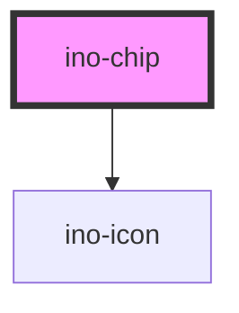

# ino-chip

The ino-chip component displays the provided content and icon as a chip.

## Usage

The component can be used as follows:

### Web Component

```js
const chip = document.querySelector('ino-chip');
chip.addEventListener('chipClicked', (e) =>
  console.log('This chip was clicked:', e.detail),
)
chip.addEventListener('chipRemoved', (e) =>
  console.log('This chip was removed:', e.detail),
);
```

```html

<ino-chip
  disabled
  fill="<string>"
  label="<string>"
  removable
  selectable
  selected
  value="<string>"
>
  <ino-icon slot=icon-leading" icon="<string>"></ino-icon>
</ino-chip>
```

### React

#### Example #1

```tsx
import { Component } from 'react';
import { InoChipSet, InoChip } from '@inovex.de/elements/dist/react';

class MyComponent extends Component {

  fruits = ["apple", "banana", "cherry"];

  handleChipClicked(e: CustomEvent<string>) {
    console.log("User clicked the fruit: ", e.detail);
  }

  render() {
    return (
      <div>
        {fruits.map(fruit => (
            <InoChip value={fruit} label={fruit} onChipClicked={this.handleChipClicked}/>
          )
        )}
      </div>
    );
  }
}
```

#### Example #2

```tsx
import React, { Component } from 'react';
import { InoChipSet, InoChip } from '@inovex.de/elements/dist/react';
import { Components } from '@inovex.de/elements/dist/types/components';

const ChipSet = () => {

  const fruits = ["apple", "banana", "cherry"];
  const [selectedFruit, setSelectedFruit] = useState < string > ("apple");

  return (
    <div>
      {fruits.map(fruit => (
        <InoChip
          value={fruit}
          label={fruit}
          selectable
          selected={fruit === selectedFruit}
          onChipClicked={(e) => setSelectedFruit(fruit)}
        />
      ))}
    </div>
  );
};
```

## Additional Hints

**Content**: Use the `label` attribute to set the label of the chip. To add an icon to the left side of the chip, use the  icon` attribute.

### Selection
A set of chips can be used to implement a single or multi selection from a handful of options.
Have a look at the **Selection** and **Filter** stories.

### Removable chips

If `removable` is set to `true`, the chip can be removed by the user. 
The component then displays a small `close` icon on the right side of the chip next to the label.

However, the component will not be hidden or destroyed but instead emits a `removeChip`-Event. Thus, the component can be removed by subscribing to the corresponding event.

## Demo

<!-- Auto Generated Below -->


## Properties

| Property       | Attribute      | Description                                                                                                                               | Type                   | Default     |
| -------------- | -------------- | ----------------------------------------------------------------------------------------------------------------------------------------- | ---------------------- | ----------- |
| `disabled`     | `disabled`     | Disables all interactions.                                                                                                                | `boolean`              | `false`     |
| `fill`         | `fill`         | The fill type of this element.                                                                                                            | `"outline" \| "solid"` | `'solid'`   |
| `label`        | `label`        | <span style="color:red">**[DEPRECATED]**</span> <br/><br/>[DEPRECATED] Please use the default slot instead  The content of the component. | `string`               | `undefined` |
| `notclickable` | `notclickable` | Marks this element as not clickable and disables all interactions like hover-effects, click-effects, pointer-cursor,...                   | `boolean`              | `false`     |
| `removable`    | `removable`    | Adds a close icon on the right side of this chip which emits the `removeChip` event on click.                                             | `boolean`              | `false`     |
| `selectable`   | `selectable`   | Makes the chip selectable.                                                                                                                | `boolean`              | `false`     |
| `selected`     | `selected`     | Marks this element as selected (**works only in conjunction with `selectable`**)                                                          | `boolean`              | `false`     |
| `value`        | `value`        | The value of this chip. Is emitted by the `chipClicked` and `chipRemoved` events.                                                         | `string`               | `undefined` |


## Events

| Event         | Description                                                                                                                     | Type                  |
| ------------- | ------------------------------------------------------------------------------------------------------------------------------- | --------------------- |
| `chipClicked` | Event that emits the `value` as soon as the user clicks on the chip.                                                            | `CustomEvent<string>` |
| `chipRemoved` | Event that emits the `value` as soon as the user clicks on the remove icon.  Listen to this event to hide or destroy this chip. | `CustomEvent<string>` |


## Slots

| Slot              | Description                                                     |
| ----------------- | --------------------------------------------------------------- |
| `"default"`       | The label text of the chip                                      |
| `"icon-leading"`  | For the icon to be prepended                                    |
| `"icon-trailing"` | For the icon to be appended - disables the `removable` property |


## Dependencies

### Depends on

- [ino-icon](../ino-icon)

### Graph


----------------------------------------------

*Built with [StencilJS](https://stenciljs.com/)*
