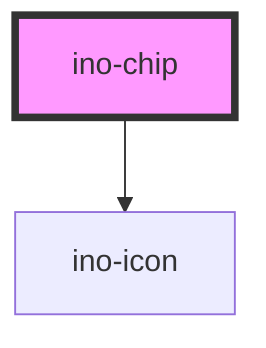

# ino-chip

<!-- Auto Generated Below -->

## Overview

The ino-chip component displays the provided content and icon as a chip.
Use the `label` attribute to set the label of the chip. To add an icon to the left side of the chip, use the `icon` attribute.

#### Additional Hints
**Content**: Utilize the `label` attribute to define the chip's label. Include an icon on the left side of the chip via the `icon` attribute.

**Selection**: Chips can be used for single or multi-selection among a few options. Refer to the **Selection** and **Filter** stories for examples.

**Removable Chips**: Set `removable` to `true` to allow chip removal by the user, which will display a `close` icon on the chip's right side. On removal, a `removeChip` event is emitted instead of hiding or destroying the component. Handle the removal process by listening to this event.

## Properties

| Property     | Attribute    | Description                                                                                                                               | Type                   | Default     |
| ------------ | ------------ | ----------------------------------------------------------------------------------------------------------------------------------------- | ---------------------- | ----------- |
| `clickable`  | `clickable`  | Marks this element as clickable and displays all interactions like hover-effects, click-effects, pointer-cursor,...                       | `boolean`              | `true`      |
| `disabled`   | `disabled`   | Disables all interactions.                                                                                                                | `boolean`              | `false`     |
| `fill`       | `fill`       | The fill type of this element.                                                                                                            | `"outline" \| "solid"` | `'solid'`   |
| `label`      | `label`      | **[DEPRECATED]**   [DEPRECATED] Please use the default slot instead  The content of the component. | `string`               | `undefined` |
| `removable`  | `removable`  | Adds a close icon on the right side of this chip which emits the `removeChip` event on click.                                             | `boolean`              | `false`     |
| `selectable` | `selectable` | Makes the chip selectable.                                                                                                                | `boolean`              | `false`     |
| `selected`   | `selected`   | Marks this element as selected (**works only in conjunction with `selectable`**)                                                          | `boolean`              | `false`     |
| `value`      | `value`      | The value of this chip. Is emitted by the `chipClicked` and `chipRemoved` events.                                                         | `string`               | `undefined` |

## Events

| Event         | Description                                                                                                                     | Type                  |
| ------------- | ------------------------------------------------------------------------------------------------------------------------------- | --------------------- |
| `chipClicked` | Event that emits the `value` as soon as the user clicks on the chip.                                                            | `CustomEvent<string>` |
| `chipRemoved` | Event that emits the `value` as soon as the user clicks on the remove icon.  Listen to this event to hide or destroy this chip. | `CustomEvent<string>` |

## Slots

| Slot              | Description                                                     |
| ----------------- | --------------------------------------------------------------- |
| `"default"`       | The label text of the chip                                      |
| `"icon-leading"`  | For the icon to be prepended                                    |
| `"icon-trailing"` | For the icon to be appended - disables the `removable` property |

## Dependencies

### Depends on

- [ino-icon](../ino-icon)

### Graph

----------------------------------------------

*Built with [StencilJS](https://stenciljs.com/)*
