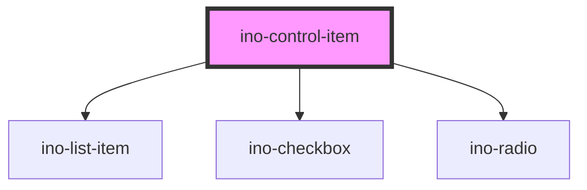

# ino-control-item

<!-- Auto Generated Below -->

## Overview

A list item component that displays a single instance of choice in a list or menu with a control element (radio-button or checkbox). It functions as a wrapper around the material [list item](https://github.com/material-components/material-components-web/blob/master/packages/mdc-list/) capabilities.

This component is used as child of `ino-list` and `ino-menu` components.
#### Restrictions
Please note that only text is supported as a trailing element. However, your icons can be placed at the leading position. To do so, use the `trailing`-Property and declare your icon inside of the element

## Properties

| Property            | Attribute        | Description                                                                                                                                      | Type      | Default     |
| ------------------- | ---------------- | ------------------------------------------------------------------------------------------------------------------------------------------------ | --------- | ----------- |
| `activated`         | `activated`      | Styles the row in an activated style.  In contrast to `selected`, use this for only one item and to mark it as permanently activated.            | `boolean` | `undefined` |
| `checked`           | `checked`        | Marks this element as checked. (**unmanaged**)                                                                                                   | `boolean` | `false`     |
| `disabled`          | `disabled`       | Disables this element.                                                                                                                           | `boolean` | `undefined` |
| `indeterminate`     | `indeterminate`  | Marks this element as indeterminate (**unmanaged**) Checkbox only                                                                                | `boolean` | `undefined` |
| `name`              | `name`           | The name of this element.                                                                                                                        | `string`  | `undefined` |
| `role` _(required)_ | `role`           | The type of control element  Valid options are 'checkbox' or 'radio'                                                                             | `string`  | `undefined` |
| `secondaryText`     | `secondary-text` | Sets the secondary text of this list item.  Requires `two-lines` on the parent `ino-list` element.                                               | `string`  | `undefined` |
| `selected`          | `selected`       | Styles the row in a selected style.  In contrast to `activated`, use this option to select one or multiple items that are likely to change soon. | `boolean` | `undefined` |
| `text` _(required)_ | `text`           | The primary text of this list item (required).                                                                                                   | `string`  | `undefined` |
| `trailing`          | `trailing`       | Places the checkbox at the end of the item                                                                                                       | `boolean` | `undefined` |
| `value`             | `value`          | The value of this element.                                                                                                                       | `string`  | `undefined` |

## Events

| Event           | Description                                                                                                                     | Type               |
| --------------- | ------------------------------------------------------------------------------------------------------------------------------- | ------------------ |
| `checkedChange` | Emits when the user clicks on the checkbox or the list item to change the checked state. Contains the status in `event.detail`. | `CustomEvent<any>` |

## Slots

| Slot        | Description |
| ----------- | ----------- |
| `"default"` | Any element |

## Dependencies

### Depends on

- [ino-list-item](../ino-list-item)
- [ino-checkbox](../ino-checkbox)
- [ino-radio](../ino-radio)

### Graph

----------------------------------------------

*Built with [StencilJS](https://stenciljs.com/)*
