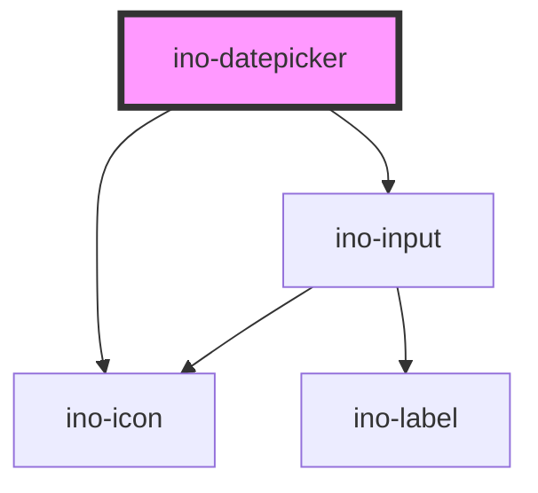

# ino-datepicker

A datepicker is a ui component to select dates and times. It behaves like a native `input` but uses the [flatpickr](https://github.com/flatpickr/flatpickr) library for a better ui experience.

## Usage

The component can be used as follows:

### Web Component

```js
document
  .querySelector('ino-datepicker')
  .addEventListener('valueChange', e =>
    alert(`The new datepicker value is: ${e.detail}`)
  );
```

```html
<ino-datepicker
  autofocus
  disabled
  name="<string>"
  required
  value="<string>"
  min="<string>"
  max="<string>"
  minute-step="<number>"
  hour-step="<number>"
  ino-range
  ino-outline
  ino-label="<string>"
  ino-pattern="<string>"
  ino-date-format="<string>"
  ino-default-date="<string>"
  ino-default-hour="<number>"
  ino-default-minute="<number>"
  ino-twelf-hour-time
  ino-helper="<string>"
  ino-helper-persistent
  ino-helper-validation
>
</ino-datepicker>
```

### React

#### Example #1 - Basic

```js
import { Component } from 'react';
import { InoDatepicker } from '@inovex.de/elements/dist/react';

class MyComponent extends Component {
  valueChange(e: any) {
    alert(`The new value is ${e.detail}`);
  }

  render() {
    return (
      <InoDatepicker
        inoLabel="Select a date"
        inoHelper="Choose a date"
        onValueChange={valueChange}
      />
    );
  }
}
```

#### Example #2 - With Types

```js
import React, { Component } from 'react';
import { InoDatepicker } from '@inovex.de/elements/dist/react';
import { Components } from '@inovex.de/elements/dist/types/components';

const Datepicker: React.FunctionComponent<Components.InoDatepickerAttributes> = props => {
  const { inoLabel, inoHelper } = props;

  const valueChange = (e: any) => {
    alert(`The new value is ${e.detail}`);
  };

  return (
    <InoDatepicker
      inoLabel={inoLabel}
      inoHelper={inoHelper}
      onValueChange={valueChange}
    />
  );
};

class MyComponent extends Component {
  render() {
    return <Datepicker inoLabel="Select a date" inoHelper="Choose a date" />;
  }
}
```

## Additional Hints
### Types
This datepicker can be used as a picker for ...
- date
- time
- datetime
- month

The type of the picker is selected based on the `ino-type` property. See the examples below.
 
#### Datepicker
```html
<ino-datepicker ino-type="date" ino-label="Date"></ino-datepicker>
```
#### Timepicker
```html
<ino-datepicker ino-type="time" ino-label="Time"></ino-datepicker>
```
#### Date-Time-Picker
```html
<ino-datepicker
  ino-type="datetime"
  ino-label="Datetime"
>
</ino-datepicker>
```
#### Monthpicker
```html
<ino-datepicker ino-type="month" ino-label="Month"></ino-datepicker>
```

## Demo

<!-- Auto Generated Below -->


## Properties

| Property              | Attribute               | Description                                                                                                                                                                       | Type                                        | Default     |
| --------------------- | ----------------------- | --------------------------------------------------------------------------------------------------------------------------------------------------------------------------------- | ------------------------------------------- | ----------- |
| `autoFocus`           | `autofocus`             | Autofocuses this element.                                                                                                                                                         | `boolean`                                   | `undefined` |
| `disabled`            | `disabled`              | Disables this element.                                                                                                                                                            | `boolean`                                   | `undefined` |
| `hourStep`            | `hour-step`             | Adjusts the step for the hour input (incl. scrolling) Default is 1                                                                                                                | `number`                                    | `1`         |
| `inoDateFormat`       | `ino-date-format`       | A string to change the date format. Possible values are listed [here](https://flatpickr.js.org/formatting/). The default value is `d-m-Y` which accepts values like `01.01.2019`. | `string`                                    | `'d-m-Y'`   |
| `inoDefaultDate`      | `ino-default-date`      | A string/array containing the initial date of the datepicker overlay. If you're using `inoRange = true` provide an array.                                                         | `string \| string[]`                        | `undefined` |
| `inoDefaultHour`      | `ino-default-hour`      | A number containing the initial hour in the date-time picker overlay. The default is `12`                                                                                         | `number`                                    | `12`        |
| `inoDefaultMinute`    | `ino-default-minute`    | A number containing the initial minute in the date-time picker overlay. The default is `0`                                                                                        | `number`                                    | `0`         |
| `inoHelper`           | `ino-helper`            | The helper text.                                                                                                                                                                  | `string`                                    | `undefined` |
| `inoHelperPersistent` | `ino-helper-persistent` | Displays the helper permanently.                                                                                                                                                  | `boolean`                                   | `undefined` |
| `inoHelperValidation` | `ino-helper-validation` | Styles the helper text as a validation message.                                                                                                                                   | `boolean`                                   | `undefined` |
| `inoLabel`            | `ino-label`             | Defines the label for this element.                                                                                                                                               | `string`                                    | `undefined` |
| `inoOutline`          | `ino-outline`           | Styles the datepicker as outlined element.                                                                                                                                        | `boolean`                                   | `undefined` |
| `inoRange`            | `ino-range`             | If true, enables the user to choose two dates as an interval. Only works with inoType="date"                                                                                      | `boolean`                                   | `undefined` |
| `inoShowLabelHint`    | `ino-show-label-hint`   | If true, an *optional* message is displayed if not required, otherwise a * marker is displayed if required                                                                        | `boolean`                                   | `undefined` |
| `inoTwelveHourTime`   | `ino-twelve-hour-time`  | If true, displays time picker in 12 hour mode with AM/PM selection.                                                                                                               | `boolean`                                   | `undefined` |
| `inoType`             | `ino-type`              | Selects the correct picker corresponding to the given type.                                                                                                                       | `"date" \| "datetime" \| "month" \| "time"` | `'date'`    |
| `max`                 | `max`                   | The maximum date that a user can pick to (inclusive).                                                                                                                             | `string`                                    | `undefined` |
| `min`                 | `min`                   | The minimum date that a user can start picking from (inclusive).                                                                                                                  | `string`                                    | `undefined` |
| `minuteStep`          | `minute-step`           | Adjusts the step for the minute input (incl. scrolling) Default is 5                                                                                                              | `number`                                    | `5`         |
| `name`                | `name`                  | The input name of this element.                                                                                                                                                   | `string`                                    | `undefined` |
| `required`            | `required`              | Marks this element as required.                                                                                                                                                   | `boolean`                                   | `undefined` |
| `value`               | `value`                 | The currently selected date shown in the input field **unmanaged**. The given value will not be formatted as date.                                                                | `string`                                    | `''`        |


## Events

| Event         | Description                                                                              | Type                  |
| ------------- | ---------------------------------------------------------------------------------------- | --------------------- |
| `valueChange` | Emits when the value of the datepicker changes. The value can be found in `event.detail` | `CustomEvent<string>` |


## Dependencies

### Depends on

- [ino-input](../ino-input)
- [ino-icon](../ino-icon)

### Graph


----------------------------------------------

*Built with [StencilJS](https://stenciljs.com/)*
