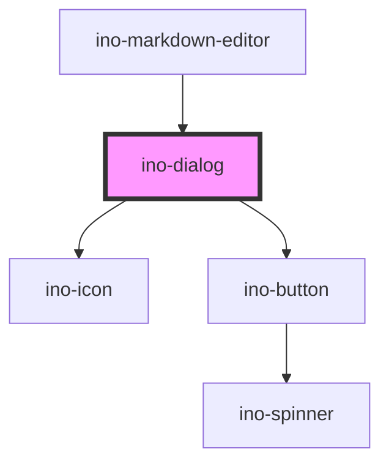

# ino-dialog

<!-- Auto Generated Below -->

## Overview

The ino-dialog component displays a modal window that can be used to display additional information or notify the user.
It is based on the mdc-dialog and is fully customizable. The styling of a dialog's content must be provided by users.

## Properties

| Property      | Attribute     | Description                                                                                                                                                            | Type                        | Default     |
| ------------- | ------------- | ---------------------------------------------------------------------------------------------------------------------------------------------------------------------- | --------------------------- | ----------- |
| `actionText`  | `action-text` | Adds a button with the given text to proceed with an action`                                                                                                           | `string`                    | `undefined` |
| `attachTo`    | `attach-to`   | The target element the dialog should be attached to. If not given, the dialog is a child of the documents body. Note: This property is immutable after initialization. | `string`                    | `undefined` |
| `bodyText`    | `body-text`   | Adds a text to the body of the `ino-dialog`                                                                                                                            | `string`                    | `undefined` |
| `cancelText`  | `cancel-text` | Adds a button with the given text to close the `ino-dialog`                                                                                                            | `string`                    | `undefined` |
| `dialogRole`  | `dialog-role` | The role of the dialog. Can be either 'dialog' or 'alertdialog'. The 'alertdialog' role should be used for important alerts and error messages.                        | `"alertdialog" \| "dialog"` | `'dialog'`  |
| `dismissible` | `dismissible` | Close the dialog by clicking outside of the dialog.                                                                                                                    | `boolean`                   | `undefined` |
| `fullwidth`   | `fullwidth`   | Defines a full width dialog sliding up from the bottom of the page.                                                                                                    | `boolean`                   | `undefined` |
| `headerText`  | `header-text` | Adds a headline to the `ino-dialog`                                                                                                                                    | `string`                    | `undefined` |
| `icon`        | `icon`        | Adds a `ino-icon` besides the headline                                                                                                                                 | `string`                    | `undefined` |
| `open`        | `open`        | Opens the dialog if set to true                                                                                                                                        | `boolean`                   | `false`     |

## Events

| Event    | Description                                                  | Type                  |
| -------- | ------------------------------------------------------------ | --------------------- |
| `action` | Emits an event upon clicking the action button of the dialog | `CustomEvent<string>` |
| `close`  | Emits an event upon closing the dialog                       | `CustomEvent<string>` |

## Slots

| Slot        | Description                                 |
| ----------- | ------------------------------------------- |
| `"body"`    | content to replace default body of dialog   |
| `"default"` | content of the dialog                       |
| `"footer"`  | content to replace default footer of dialog |
| `"header"`  | content to replace default header of dialog |

## CSS Custom Properties

| Name                            | Description                                                           |
| ------------------------------- | --------------------------------------------------------------------- |
| `--ino-dialog-background-color` | Background color of the dialog. [color:#fff]                          |
| `--ino-dialog-border`           | Border shorthand of the dialog. [text:1px solid #2c02ff]              |
| `--ino-dialog-border-radius`    | Border radius of the dialog. [size:17]                                |
| `--ino-dialog-box-shadow`       | Box shadow of the dialog. [text:0px 0px 22px rgba(93, 91, 105, 0.35)] |
| `--ino-dialog-height`           | height of the dialog. [size]                                          |
| `--ino-dialog-max-height`       | Max height of the dialog. [size]                                      |
| `--ino-dialog-max-width`        | Max width of the dialog. [size:552]                                   |
| `--ino-dialog-min-height`       | Min height of the dialog. [size]                                      |
| `--ino-dialog-min-width`        | Min width of the dialog. [size:480]                                   |
| `--ino-dialog-padding`          | Padding of the dialog. [size:62]                                      |
| `--ino-dialog-width`            | Width of the dialog. [size]                                           |

## Dependencies

### Used by

 - [ino-markdown-editor](../ino-markdown-editor)

### Depends on

- [ino-icon](../ino-icon)
- [ino-button](../ino-button)

### Graph

----------------------------------------------

*Built with [StencilJS](https://stenciljs.com/)*
