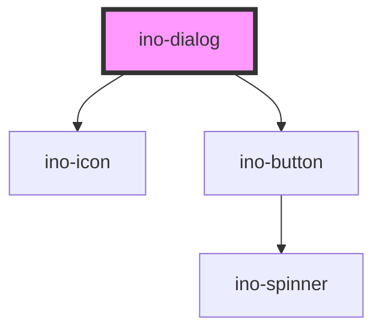

# ino-dialog

The ino-dialog component displays a modal window that can be used to display additional information or notify the user.
It is based on the mdc-dialog and is fully customizable. The styling of a dialog's content must be provided by users.

## Usage

The component can be used as follows:

### Web Component

```js
document
  .querySelector('ino-dialog')
  .addEventListener('close', (e) =>
    alert(`dialog has been closed with action: ${e.detail}`),
  );
```

```html
<ino-dialog>
  <div class="awesome-content"></div>
</ino-dialog>
```

### React

```jsx
import React from 'react';
import { Component } from 'react';
import { InoButton, InoDialog } from '@inovex.de/elements/dist/react';

class MyComponent extends Component {

  state = {
    open: false
  };

  handleEvent = () => {
    this.setState((open) => ({
      open: !open
    }))
  };

  render() {
    return (
      <>
        <InoButton onClick={() => this.handleEvent()}>Open Dialog</InoButton>
        <InoDialog open={this.state.open}>
          <div class="awesome-content"/>
        </InoDialog>
      </>
    );
  }
}
```

## Additional information

### Sizing
The dialog is displayed in the middle (horiziontally and vertically centered) on a surface.
In order to customize the dialog's size, use the `--ino-dialog-height` and `--ino-dialog-width` properties.
Either use a fixed value or use css calc (f.e. `calc(100% - 60px)` to add a margin auf `30px` on both sides).

### Fullwidth
A Fullwidth dialog is a distinct variant which has 100% width an is attached to the bottom of the page. It scrolls up and defines a small
margin at top for the background scrim and escape for dialog close. It's not recommenended to use this option with `--ino-dialog-width` and `--ino-dialog-height`.

### Closing actions
You can mark elements as "action elements" by providing a `data-ino-dialog-action="action-name"` attribute.
On user clicks, the dialog checks whether the target is a dialog action and, if true, emits a `close` event with `event.detail = "action-name"`.

Subsequently, listen to the `close` Event and check the `event.detail` to retrieve the users action.

<!-- Auto Generated Below -->


## Properties

| Property       | Attribute      | Description                                                                                                                                                            | Type      | Default     |
| -------------- | -------------- | ---------------------------------------------------------------------------------------------------------------------------------------------------------------------- | --------- | ----------- |
| `actionbutton` | `actionbutton` | Adds a button with the given text to proceed with an action`                                                                                                           | `string`  | `undefined` |
| `attachTo`     | `attach-to`    | The target element the dialog should be attached to. If not given, the dialog is a child of the documents body. Note: This property is immutable after initialization. | `string`  | `undefined` |
| `cancelbutton` | `cancelbutton` | Adds a button with the given text to close the `ino-dialog`                                                                                                            | `string`  | `undefined` |
| `description`  | `description`  | Adds a text to the body of the `ino-dialog`                                                                                                                            | `string`  | `undefined` |
| `dismissible`  | `dismissible`  | Close the dialog on pressing the ESC key or clicking outside of the dialog.                                                                                            | `boolean` | `undefined` |
| `fullwidth`    | `fullwidth`    | Defines a full width dialog sliding up from the bottom of the page.                                                                                                    | `boolean` | `undefined` |
| `headline`     | `headline`     | Adds a headline to the `ino-dialog`                                                                                                                                    | `string`  | `undefined` |
| `icon`         | `icon`         | Adds a `ino-icon` besides the headline                                                                                                                                 | `string`  | `undefined` |
| `open`         | `open`         | Opens the dialog if set to true                                                                                                                                        | `boolean` | `false`     |


## Events

| Event   | Description                            | Type                  |
| ------- | -------------------------------------- | --------------------- |
| `close` | Emits an event upon closing the dialog | `CustomEvent<string>` |


## Slots

| Slot        | Description           |
| ----------- | --------------------- |
| `"default"` | content of the dialog |


## Dependencies

### Depends on

- [ino-icon](../ino-icon)
- [ino-button](../ino-button)

### Graph


----------------------------------------------

*Built with [StencilJS](https://stenciljs.com/)*
