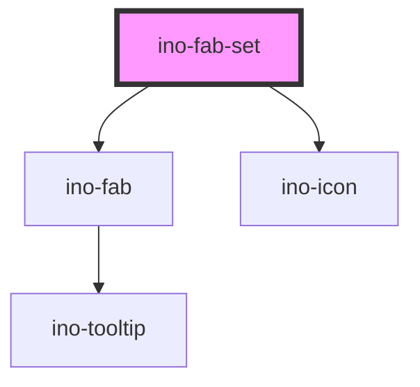

# ino-fab-set

<!-- Auto Generated Below -->

## Overview

The ino-fab-set component serves as a container for multiple fab buttons. It contains actions related to the main fab
button. Upon interacting with the fab button, a FAB-Set can display three to six related actions in the form of a speed
dial.

#### Additional Hints
**Content**: Put the FABs for the speed dial inside of `ino-fab-set` as `ino-fab`.

#### Control flow

The ino-fab-set has a controlled (unmanaged) attribute `openDial`. For this reason, listen to `click` events, sync to
your local state and pass the state to the component again to open/close the fab-set.

## Properties

| Property            | Attribute             | Description                                                                                   | Type                                     | Default            |
| ------------------- | --------------------- | --------------------------------------------------------------------------------------------- | ---------------------------------------- | ------------------ |
| `dialDirection`     | `dial-direction`      | The direction of the speed dial. Possible values: `top` (default), `bottom`, `right`, `left`. | `"bottom" \| "left" \| "right" \| "top"` | `'top'`            |
| `icon`              | `icon`                | The icon of the fab set.                                                                      | `string`                                 | `'options_dotted'` |
| `label`             | `label`               | The label of the fab set when the variant is `stacked`.                                       | `string`                                 | `undefined`        |
| `leftRightLocation` | `left-right-location` | The side where the Fab is displayed. Possible values: `right`, `left` (default).              | `"left" \| "right"`                      | `'left'`           |
| `openDial`          | `open-dial`           | Opens the dial (**uncontrolled**)                                                             | `boolean`                                | `false`            |
| `topBottomLocation` | `top-bottom-location` | The side where the Fab is displayed. Possible values: `top`, `bottom` (default).              | `"bottom" \| "top"`                      | `'bottom'`         |
| `variant`           | `variant`             | The variant of the fab set.                                                                   | `"menu" \| "stacked"`                    | `'menu'`           |

## Slots

| Slot            | Description                                   |
| --------------- | --------------------------------------------- |
| `"default"`     | One or more `ino-fab`                         |
| `"icon-closed"` | The icon of the FAB button while being closed |
| `"icon-opened"` | The icon of the FAB button while being open   |

## Dependencies

### Depends on

- [ino-fab](../ino-fab)
- [ino-icon](../ino-icon)

### Graph

----------------------------------------------

*Built with [StencilJS](https://stenciljs.com/)*
