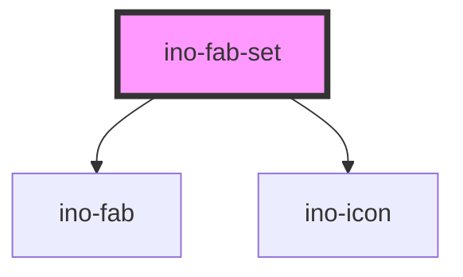

# ino-fab-set

<!-- Auto Generated Below -->

## Overview

The ino-fab-set component serves as a container for multiple fab buttons. It contains actions related to the main fab
button. Upon interacting with the fab button, a FAB-Set can display three to six related actions in the form of a speed
dial.

#### Additional Hints
**Content**: Put the FABs for the speed dial inside of `ino-fab-set` as `ino-fab`.

#### Control flow

The ino-fab-set has a controlled (unmanaged) attribute `openDial`. For this reason, listen to `click` events, sync to
your local state and pass the state to the component again to open/close the fab-set.

## Properties

| Property      | Attribute     | Description                                                                    | Type                         | Default     |
| ------------- | ------------- | ------------------------------------------------------------------------------ | ---------------------------- | ----------- |
| `label`       | `label`       | The label of the fab set when the variant is `stacked`.                        | `string`                     | `undefined` |
| `openDial`    | `open-dial`   | Opens the dial (**uncontrolled**)                                              | `boolean`                    | `false`     |
| `orientation` | `orientation` | The orientation of the dial in which the secondary ino-fabs will be displayed. | `"horizontal" \| "vertical"` | `undefined` |

## Slots

| Slot            | Description                         |
| --------------- | ----------------------------------- |
| `"primary-fab"` | The main fab button of the fab set. |

## Dependencies

### Depends on

- [ino-fab](../ino-fab)
- [ino-icon](../ino-icon)

### Graph

----------------------------------------------

*Built with [StencilJS](https://stenciljs.com/)*
