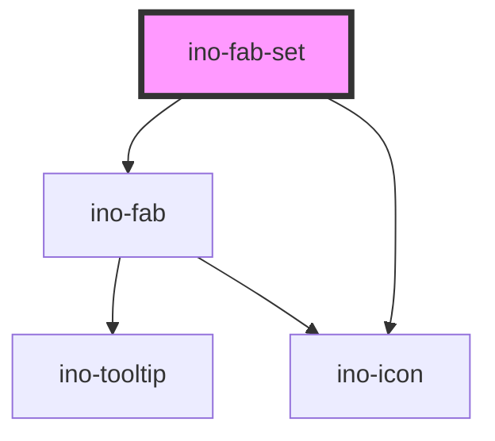

# ino-fab-set

The ino-fab-set component serves as a container for multiple fab buttons. It contains actions related to the main fab
button. Upon interacting with the fab button, a FAB-Set can display three to six related actions in the form of a speed
dial.

### Usage

The component can be used as follows:

```html

<ino-fab-set
  top-bottom-location="<string>"
  left-right-location="<string>"
  dial-direction="<string>"
  open-dial
>
  <ino-fab ...></ino-fab>
  <ino-fab ...></ino-fab>
  ...
</ino-fab-set>
```

### React

#### Example #1 - Basic

```js
import { Component } from 'react';
import { InoFab, InoFabSet } from '@inovex.de/elements/dist/react';

class MyComponent extends Component {
  state = {
    open: false,
  };

  handleClick = (e: any) => {
    alert(`Fab-Set was clicked`);
    this.setState({ open: !this.state.open });
  };

  render() {
    return (
      <FabSet
        openDial={this.state.open}
        dialDirection="top"
        onClick={handleClick}
      >
        <InoFab mini label="Profile" icon="person"/>
        <InoFab mini label="Search" icon="search"/>
        <InoFab mini label="Help" icon="help"/>
      </FabSet>
    );
  }
}
```

#### Example #2 - With Types

```js
import React, { Component } from 'react';
import { InoFab, InoFabSet } from '@inovex.de/elements/dist/react';
import { Components } from '@inovex.de/elements/dist/types/components';

const FabSet: React.FunctionComponent<Components.InoFabSetAttributes> = (
  props,
) => {
  const { dialDirection } = props;

  return (
    <InoFabSet dialDirection={dialDirection}>{props.children}</InoFabSet>
  );
};

class MyComponent extends Component {
  render() {
    return (
      <FabSet dialDirection="top">
        <InoFab mini label="Profile" icon="person"/>
        <InoFab mini label="Search" icon="search"/>
        <InoFab mini label="Help" icon="help"/>
      </FabSet>
    );
  }
}
```

## Additional Hints

**Content**: Put the FABs for the speed dial inside of `ino-fab-set` as `ino-fab`.

### Manage icons

> **Note:** To use the provided icons in your consumer project, you need to copy all contents of
> `node_modules/@inovex.de/elements/dist/inovex-elements/ino-icon` into your `dist/ino-icon` folder. All icons are expected
> at runtime to be located in `ino-icon/`. Please refer to the Storybook documentation to get detailed instructions
> on how to integrate the icons with Angular, React or plain JavaScript.

## Control flow

The ino-fab-set has a controlled (unmanaged) attribute `openDial`. For this reason, listen to `click` events, sync to
your local state and pass the state to the component again to open/close the fab-set.

<!-- Auto Generated Below -->

## Properties

| Property            | Attribute             | Description                                                                                   | Type                                     | Default    |
| ------------------- | --------------------- | --------------------------------------------------------------------------------------------- | ---------------------------------------- | ---------- |
| `dialDirection`     | `dial-direction`      | The direction of the speed dial. Possible values: `top` (default), `bottom`, `right`, `left`. | `"bottom" \| "left" \| "right" \| "top"` | `'top'`    |
| `leftRightLocation` | `left-right-location` | The side where the Fab is displayed. Possible values: `right`, `left` (default).              | `"left" \| "right"`                      | `'left'`   |
| `openDial`          | `open-dial`           | Opens the dial (**
uncontrolled**)                                                             | `boolean`                                | `false`    |
| `topBottomLocation` | `top-bottom-location` | The side where the Fab is displayed. Possible values: `top`, `bottom` (default).              | `"bottom" \| "top"`                      | `'bottom'` |

## Dependencies

### Depends on

- [ino-fab](../ino-fab)
- [ino-icon](../ino-icon)

### Graph



----------------------------------------------

*Built with [StencilJS](https://stenciljs.com/)*
