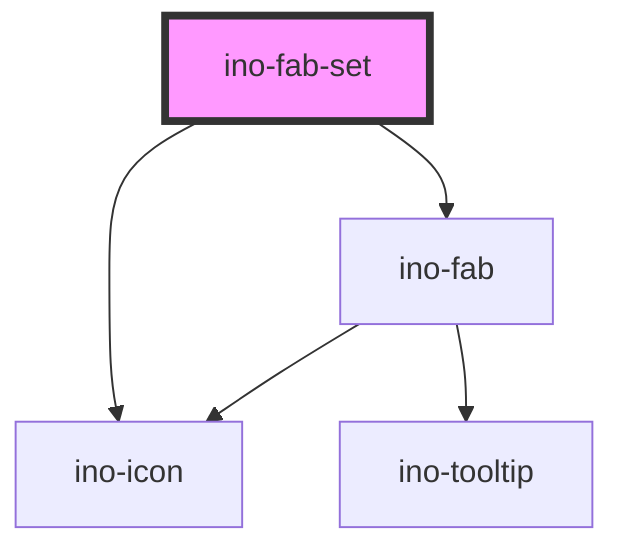

# ino-fab-set

This component is a container for multiple fab buttons. This collection of fab buttons contains actions related to the main fab button.
When hovered, a FAB-Set can display three to six related actions in the form of a speed dial.

### Usage

The component can be used as follows:

```html
<ino-fab-set
  ino-top-bottom-location="<string>"
  ino-left-right-location="<string>"
  ino-dial-direction="<string>"
  ino-open-dial
>
  <ino-fab ...></ino-fab>
  <ino-fab ...></ino-fab>
  ...
</ino-fab-set>
```

### React

#### Example #1 - Basic

```js
import { Component } from 'react';
import { InoFab, InoFabSet } from '@inovex/elements/dist/react';

class MyComponent extends Component {

  state = {
    open: false
  } 

  handleClick = (e: any) => {
    alert(`Fab-Set was clicked`);
    this.setState({open: !this.state.open})
  };

  render() {
    return (
      <FabSet inoOpenDial={this.state.open} inoDialDirection="top" onClick={handleClick}>
        <InoFab
          inoMini
          inoLabel="Profile"
          inoIcon="person"
        />
        <InoFab
          inoMini
          inoLabel="Search"
          inoIcon="search"
        />
        <InoFab inoMini inoLabel="Help" inoIcon="help" />
      </FabSet>
    );
  }
}
```

#### Example #2 - With Types

```js
import React, { Component } from 'react';
import { InoFab, InoFabSet } from '@inovex/elements/dist/react';
import { Components } from '@inovex/elements/dist/types/components';

const FabSet: React.FunctionComponent<Components.InoFabSetAttributes> = props => {
  const { inoDialDirection } = props;

  return (
    <InoFabSet inoDialDirection={inoDialDirection}>{props.children}</InoFabSet>
  );
};

class MyComponent extends Component {
  render() {
    return (
      <FabSet inoDialDirection="top">
        <InoFab inoMini inoLabel="Profile" inoIcon="person" />
        <InoFab inoMini inoLabel="Search" inoIcon="search" />
        <InoFab inoMini inoLabel="Help" inoIcon="help" />
      </FabSet>
    );
  }
}
```

## Additional Hints

**Content**: Put the the FABs for the speed dial inside of `ino-fab-set` as `ino-fab`.

## Control flow

The ino-fab-set has a controlled (unmanaged) attribute `inoOpenDial`. For this reason listen to `click` events, sync to your local state and pass the state to the component again to open/close the fab-set.

<!-- Auto Generated Below -->


## Properties

| Property               | Attribute                 | Description                                                                                   | Type                                     | Default    |
| ---------------------- | ------------------------- | --------------------------------------------------------------------------------------------- | ---------------------------------------- | ---------- |
| `inoDialDirection`     | `ino-dial-direction`      | The direction of the speed dial. Possible values: `top` (default), `bottom`, `right`, `left`. | `"bottom" \| "left" \| "right" \| "top"` | `'top'`    |
| `inoLeftRightLocation` | `ino-left-right-location` | The side where the Fab is displayed. Possible values: `right`, `left` (default).              | `"left" \| "right"`                      | `'left'`   |
| `inoOpenDial`          | `ino-open-dial`           | Opens the dial (**uncontrolled**)                                                             | `boolean`                                | `false`    |
| `inoTopBottomLocation` | `ino-top-bottom-location` | The side where the Fab is displayed. Possible values: `top`, `bottom` (default).              | `"bottom" \| "top"`                      | `'bottom'` |


## Dependencies

### Depends on

- [ino-fab](../ino-fab)
- [ino-icon](../ino-icon)

### Graph


----------------------------------------------

*Built with [StencilJS](https://stenciljs.com/)*
