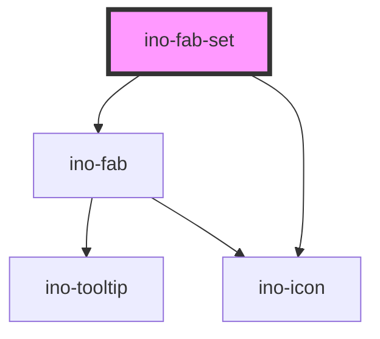

# ino-fab-set

<!-- Auto Generated Below -->

## Properties

| Property            | Attribute             | Description                                                                                   | Type                                     | Default    |
| ------------------- | --------------------- | --------------------------------------------------------------------------------------------- | ---------------------------------------- | ---------- |
| `dialDirection`     | `dial-direction`      | The direction of the speed dial. Possible values: `top` (default), `bottom`, `right`, `left`. | `"bottom" \| "left" \| "right" \| "top"` | `'top'`    |
| `leftRightLocation` | `left-right-location` | The side where the Fab is displayed. Possible values: `right`, `left` (default).              | `"left" \| "right"`                      | `'left'`   |
| `openDial`          | `open-dial`           | Opens the dial (**uncontrolled**)                                                             | `boolean`                                | `false`    |
| `topBottomLocation` | `top-bottom-location` | The side where the Fab is displayed. Possible values: `top`, `bottom` (default).              | `"bottom" \| "top"`                      | `'bottom'` |

## Slots

| Slot            | Description                                                                                                                                                                                                                                                                                        |
| --------------- | -------------------------------------------------------------------------------------------------------------------------------------------------------------------------------------------------------------------------------------------------------------------------------------------------- |
| `"default"`     | One or more `ino-fab`                                                                                                                                                                                                                                                                              |
| `"icon-closed"` | The icon of the FAB button while being closed  The ino-fab-set component serves as a container for multiple fab buttons. It contains actions related to the main fab button. Upon interacting with the fab button, a FAB-Set can display three to six related actions in the form of a speed dial. |
| `"icon-opened"` | The icon of the FAB button while being open                                                                                                                                                                                                                                                        |

## Dependencies

### Depends on

- [ino-fab](../ino-fab)
- [ino-icon](../ino-icon)

### Graph

----------------------------------------------

*Built with [StencilJS](https://stenciljs.com/)*
