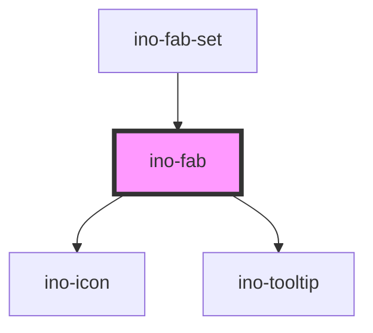

# ino-fab

A floating action button represents the primary action in an application. [Floating Action Button](https://github.com/material-components/material-components-web/tree/master/packages/mdc-fab) component.
It appears in front of all screen content, typically as a circular shape with an icon in its center.

FABs come in three types: regular, mini, and extended.
### Usage

The component can be used as follows:

```html
<ino-fab
  ino-color-scheme="<string>"
  ino-icon="<string>"
  ino-label="<string>"
  ino-extended
  ino-mini
  ino-tooltip-placement="<string>"
  ino-disabled
>
</ino-fab>
```

### React

#### Example #1 - Basic

```js
import { Component } from 'react';
import { InoFab } from '@inovex/elements/dist/react';

class MyComponent extends Component {
  handleClick = (e: any) => {
    alert(`Fab was clicked`);
  };

  render() {
    return (
      <InoFab
        inoIcon="star"
        inoLabel="This is a fab"
        onClick={this.handleClick}
      />
    );
  }
}
```

#### Example #2 - With Types

```js
import React, { Component } from 'react';
import { InoFab } from '@inovex/elements/dist/react';
import { Components } from '@inovex/elements/dist/types/components';

const Fab: React.FunctionComponent<Components.InoFabAttributes> = props => {
  const { inoLabel, inoIcon } = props;

  const handleClick = (e: any) => {
    alert(`Fab was clicked`);
  };

  return <InoFab inoIcon={inoIcon} inoLabel={inoLabel} onClick={handleClick} />;
};

class MyComponent extends Component {
  render() {
    return <Fab inoLabel="This is a fab" inoIcon="star" />;
  }
}
```

## Additional Hints

**Content**: Use the `ino-label` attribute to set the text of a fab. To add an icon, use the `ino-icon` attribute.

**Styling**: The fab can be styled in many different ways using the `ino-color-scheme` attribute. See the attribute documentation below for additional information.

## Demo

<!-- Auto Generated Below -->


## Properties

| Property              | Attribute               | Description                                                                                                                                                                                           | Type                                                                                                                                                                                                                   | Default     |
| --------------------- | ----------------------- | ----------------------------------------------------------------------------------------------------------------------------------------------------------------------------------------------------- | ---------------------------------------------------------------------------------------------------------------------------------------------------------------------------------------------------------------------- | ----------- |
| `inoColorScheme`      | `ino-color-scheme`      | The name of the color scheme which is used to style the background and outline of this component. Possible values: `primary` (default),  `secondary`, `success`, `warning`, `error`, `light`, `dark`. | `"dark" \| "error" \| "light" \| "primary" \| "secondary" \| "success" \| "warning"`                                                                                                                                   | `'primary'` |
| `inoDisabled`         | `ino-disabled`          | Disables the button.                                                                                                                                                                                  | `boolean`                                                                                                                                                                                                              | `false`     |
| `inoEdgePosition`     | `ino-edge-position`     | The position of the edge.                                                                                                                                                                             | `"bottom-left" \| "bottom-right" \| "none" \| "top-left" \| "top-right"`                                                                                                                                               | `undefined` |
| `inoExtended`         | `ino-extended`          | Optional, modifies the FAB to wider size which includes a text label.                                                                                                                                 | `boolean`                                                                                                                                                                                                              | `false`     |
| `inoIcon`             | `ino-icon`              | Adds an icon to the Fab.                                                                                                                                                                              | `string`                                                                                                                                                                                                               | `undefined` |
| `inoLabel`            | `ino-label`             | Optional, for the text label. Applicable only for Extended FAB.                                                                                                                                       | `string`                                                                                                                                                                                                               | `undefined` |
| `inoMini`             | `ino-mini`              | Optional, modifies the FAB to a smaller size                                                                                                                                                          | `boolean`                                                                                                                                                                                                              | `false`     |
| `inoTooltipPlacement` | `ino-tooltip-placement` | The placement of the tooltip which will be displayed when the button is not extended. Use `none`, if you don't want a tooltip to be displayed.                                                        | `"auto" \| "auto-end" \| "auto-start" \| "bottom" \| "bottom-end" \| "bottom-start" \| "left" \| "left-end" \| "left-start" \| "none" \| "right" \| "right-end" \| "right-start" \| "top" \| "top-end" \| "top-start"` | `'left'`    |


## Dependencies

### Used by

 - [ino-fab-set](../ino-fab-set)

### Depends on

- [ino-icon](../ino-icon)
- [ino-tooltip](../ino-tooltip)

### Graph


----------------------------------------------

*Built with [StencilJS](https://stenciljs.com/)*
