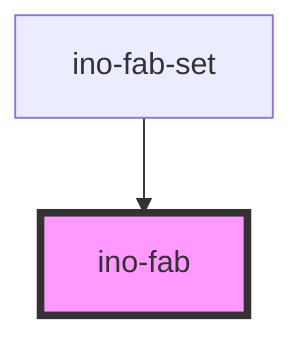

# ino-fab

<!-- Auto Generated Below -->

## Overview

A floating action button represents the primary action in an application. [Floating Action Button](https://github.com/material-components/material-components-web/tree/master/packages/mdc-fab) component.
It appears in front of all screen content, typically as a circular shape with an icon in its center.

FABs come in three types: regular, mini, and extended

#### Additional Hints

**Content**: Use the  label` attribute to set the text of a fab. To add an icon, use the  icon` attribute.

## Properties

| Property       | Attribute       | Description                                                                                               | Type                                                                     | Default       |
| -------------- | --------------- | --------------------------------------------------------------------------------------------------------- | ------------------------------------------------------------------------ | ------------- |
| `disabled`     | `disabled`      | Disables the button.                                                                                      | `boolean`                                                                | `false`       |
| `edgePosition` | `edge-position` | The position of the edge.                                                                                 | `"bottom-left" \| "bottom-right" \| "none" \| "top-left" \| "top-right"` | `'top-right'` |
| `label`        | `label`         | Optional, for the text label. Applicable only for Extended FAB.                                           | `string`                                                                 | `undefined`   |
| `shadow`       | `shadow`        | Optional, displays a shadow around the button. Flat when it should be part of a button, shadow to abheben | `boolean`                                                                | `false`       |
| `variant`      | `variant`       | The variant of the FAB.                                                                                   | `"extended" \| "large" \| "small" \| "standard"`                         | `'standard'`  |

## Slots

| Slot             | Description                  |
| ---------------- | ---------------------------- |
| `"icon-leading"` | For the icon to be prepended |

## CSS Custom Properties

| Name                              | Description                           |
| --------------------------------- | ------------------------------------- |
| `--fab-background-color`          | Background color                      |
| `--fab-background-color-active`   | Background color if active            |
| `--fab-background-color-disabled` | Background color if disabled          |
| `--fab-background-color-hover`    | Background color on hover             |
| `--fab-color-disabled`            | Text color if disabled                |
| `--fab-icon-color`                | Color of the slotted icon             |
| `--fab-icon-color-disabled`       | Color of the slotted icon if disabled |
| `--ino-fab-color`                 | Text color                            |

## Dependencies

### Used by

 - [ino-fab-set](../ino-fab-set)

### Graph

----------------------------------------------

*Built with [StencilJS](https://stenciljs.com/)*
