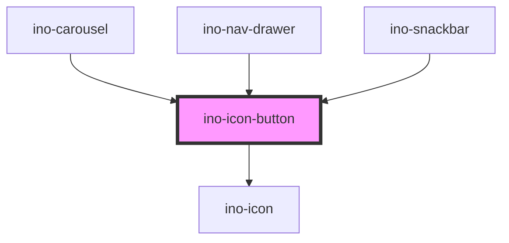

# ino-icon-button

A rounded button component that contains an icon. It functions as a wrapper around the material [icon-button](https://github.com/material-components/material-components-web/tree/master/packages/mdc-icon-button) component.

### Usage

The component can be used as follows:

```js
document
  .querySelector('ino-icon-button')
  .addEventListener('click', (_) => alert('The icon button was clicked'));
```

```html
<ino-icon-button
  autofocus
  disabled
  ino-activated="<boolean>"
  ino-icon="<string>"
>
</ino-icon-button>
```

### React

#### Example #1 - Basic

```js
import { Component } from 'react';
import { InoIconButton } from '@inovex.de/elements/dist/react';

class MyComponent extends Component {
  handleClick = (e: any) => {
    alert(`IconButton was clicked`);
  };

  render() {
    return <InoIconButton inoIcon="search" onClick={handleClick} />;
  }
}
```

#### Example #2 - With Types

```js
import React, { Component } from 'react';
import { InoIconButton } from '@inovex.de/elements/dist/react';
import { Components } from '@inovex.de/elements/dist/types/components';

const IconButton: React.FunctionComponent<Components.InoIconButtonAttributes> = (
  props,
) => {
  const { inoIcon } = props;

  const handleClick = (e: any) => {
    alert(`IconButton was clicked`);
  };

  return (
    <InoIconButton inoIcon={inoIcon} onClick={handleClick}>
      {props.children}
    </InoIconButton>
  );
};

class MyComponent extends Component {
  render() {
    return <IconButton inoIcon="search" />;
  }
}
```

## Managed Icon Button

Buttons, and icon buttons as well, are unmanaged components which swap their state internally based on the interactions. However, in some cases, it may be useful to change this behavior and provide an external state.

This can be done by using the `ino-activated` flag and further listing to the `click` event to change the state. _Example:_

```js
inoActivated = false;

document.querySelector('ino-icon-button').addEventListener('click', (e) => {
  const el = e.target;
  inoActivated = !inoActivated;
  inoActivated
    ? el.addAttribute('ino-activated')
    : el.removeAttribute('ino-activated');
});
```

```html
<ino-icon-button ino-icon="info"></ino-icon-button>
```

## Additional Hints

**Toggle Button**: To use the ino-icon-button as a toggle button the user can listen to the native `click`-Event and change the icon in `ino-icon`-Attribute.

### Native Events

The component bubbles the native `click`-Event to the user.

<!-- Auto Generated Below -->

## Properties

| Property         | Attribute          | Description                                                                                                                                                                                          | Type                                                                                 | Default     |
| ---------------- | ------------------ | ---------------------------------------------------------------------------------------------------------------------------------------------------------------------------------------------------- | ------------------------------------------------------------------------------------ | ----------- |
| `autoFocus`      | `autofocus`        | Sets the autofocus for this element.                                                                                                                                                                 | `boolean`                                                                            | `undefined` |
| `disabled`       | `disabled`         | Disables this element.                                                                                                                                                                               | `boolean`                                                                            | `undefined` |
| `inoActivated`   | `ino-activated`    | Marks the icon button as activated. Useful in cases where an external state controls the icon button activation. Makes the component **managed**.                                                    | `boolean`                                                                            | `undefined` |
| `inoColorScheme` | `ino-color-scheme` | The name of the color scheme which is used to style the background and outline of this component. Possible values: `primary` (default), `secondary`, `success`, `warning`, `error`, `light`, `dark`. | `"dark" \| "error" \| "light" \| "primary" \| "secondary" \| "success" \| "warning"` | `'primary'` |
| `inoFilled`      | `ino-filled`       | Styles this element as filled icon button with the `ino-color-scheme` as background color.                                                                                                           | `boolean`                                                                            | `undefined` |
| `inoIcon`        | `ino-icon`         | The name of the icon of this element.                                                                                                                                                                | `string`                                                                             | `undefined` |
| `type`           | `type`             | The type of this form. Can either be `button`, `submit` or `reset`.                                                                                                                                  | `"button" \| "reset" \| "submit"`                                                    | `'button'`  |

## Events

| Event     | Description | Type               |
| --------- | ----------- | ------------------ |
| `clickEl` |             | `CustomEvent<any>` |

## CSS Custom Properties

| Name                                        | Description                         |
| ------------------------------------------- | ----------------------------------- |
| `--ino-icon-button-background-active-color` | base color of the active background |
| `--ino-icon-button-background-color`        | default color of the background     |
| `--ino-icon-button-icon-active-color`       | color of the active icon itself     |
| `--ino-icon-button-icon-color`              | default color of the icon itself    |
| `--ino-icon-button-icon-size`               | size of the icon itself             |
| `--ino-icon-button-size`                    | size of the entire button           |

## Dependencies

### Used by

- [ino-carousel](../ino-carousel)
- [ino-nav-drawer](../ino-nav-drawer)
- [ino-snackbar](../ino-snackbar)

### Depends on

- [ino-icon](../ino-icon)

### Graph



---

_Built with [StencilJS](https://stenciljs.com/)_
