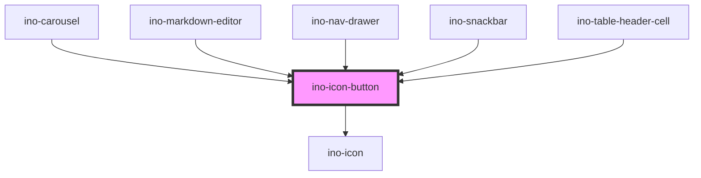

# ino-icon-button

<!-- Auto Generated Below -->

## Overview

A rounded button component that contains an icon. It functions as a wrapper around the material [icon-button](https://github.com/material-components/material-components-web/tree/master/packages/mdc-icon-button) component.

## Additional Hints
**Toggle Button**: To use the ino-icon-button as a toggle button the user can listen to the native `click`-Event and change the icon in the `icon`-Attribute.

## Properties

| Property    | Attribute   | Description                                                                                                                                        | Type                                                     | Default     |
| ----------- | ----------- | -------------------------------------------------------------------------------------------------------------------------------------------------- | -------------------------------------------------------- | ----------- |
| `activated` | `activated` | Marks the icon button as activated.  Useful in cases where an external state controls the icon button activation. Makes the component **managed**. | `boolean`                                                | `undefined` |
| `attrs`     | --          | Allows the specification of native HTML attributes on the underlying HTML element                                                                  | `HTMLAttributes<HTMLButtonElement> & Partial<ARIAMixin>` | `undefined` |
| `autoFocus` | `autofocus` | Sets the autofocus for this element.                                                                                                               | `boolean`                                                | `undefined` |
| `disabled`  | `disabled`  | Disables this element.                                                                                                                             | `boolean`                                                | `undefined` |
| `filled`    | `filled`    | Styles this element as filled icon button with the `ino-color-scheme` as background color.                                                         | `boolean`                                                | `undefined` |
| `icon`      | `icon`      | The name of the icon of this element.                                                                                                              | `string`                                                 | `undefined` |
| `type`      | `type`      | The type of this form.  Can either be `button`, `submit` or `reset`.                                                                               | `"button" \| "reset" \| "submit"`                        | `'button'`  |

## Events

| Event     | Description                                                                                                        | Type               |
| --------- | ------------------------------------------------------------------------------------------------------------------ | ------------------ |
| `clickEl` | Event that emits as soon as the user clicks on the icon. The event only emits if the property `clickable` is true. | `CustomEvent<any>` |

## Slots

| Slot        | Description  |
| ----------- | ------------ |
| `"default"` | `<ino-icon>` |

## CSS Custom Properties

| Name                                          | Description                                                     |
| --------------------------------------------- | --------------------------------------------------------------- |
| `--ino-icon-button-background-active-color`   | Base color of the active background. [color:#4655ff]            |
| `--ino-icon-button-background-color`          | Default color of the background. [color:transparent]            |
| `--ino-icon-button-background-disabled-color` | Base color of the background in disabled state. [color:#100707] |
| `--ino-icon-button-icon-active-color`         | Color of the active icon itself. [color:#4655ff]                |
| `--ino-icon-button-icon-color`                | Default color of the icon itself. [color:#4655ff]               |
| `--ino-icon-button-icon-disabled-color`       | Color of the icon itself in disabled state. [color:#100707]     |
| `--ino-icon-button-icon-size`                 | Size of the icon itself. [size:24]                              |
| `--ino-icon-button-size`                      | Size of the entire button. [size:48]                            |

## Dependencies

### Used by

 - [ino-carousel](../ino-carousel)
 - [ino-markdown-editor](../ino-markdown-editor)
 - [ino-nav-drawer](../ino-nav-drawer)
 - [ino-snackbar](../ino-snackbar)
 - [ino-table-header-cell](../ino-table-header-cell)

### Depends on

- [ino-icon](../ino-icon)

### Graph

----------------------------------------------

*Built with [StencilJS](https://stenciljs.com/)*
