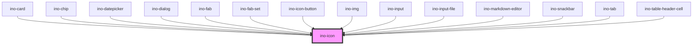

# ino-icon

<!-- Auto Generated Below -->

## Overview

A light icon component for texts and other components.
This component is based on the ionicons (https://github.com/ionic-team/ionicons)

#### Additional Hints
The component inherits styles, such as the text size, from the parent element. For custom styles, use the css properties of the component.

**Clickable icon:** Make an icon interactive with the optional attribute `clickable`. Clickable icons emit a `clickEl` event.

#### Add icons
If you would like to add custom icons, you have to add the `.svg` file to the `src/assets/ino-icon` folder and run the `yarn integrate:icons` script which takes care of the rest.

> **Note:** To use the provided icons in your consumer project, you need to copy all contents of
> `node_modules/@inovex.de/elements/dist/inovex-elements/ino-icon` into your `dist/ino-icon` folder. All icons are expected
> to be located in `ino-icon/` at runtime. Please refer to the Storybook documentation to get detailed instructions
> on how to integrate the icons with Angular, React or plain JavaScript.

Alternatively, you can also just provide the URL to your preferred icon by setting the `src` property accordingly.

## Properties

| Property         | Attribute         | Description                                                           | Type      | Default     |
| ---------------- | ----------------- | --------------------------------------------------------------------- | --------- | ----------- |
| `clickable`      | `clickable`       | Makes the icon clickable and allows to listen to the `clickEl` event. | `boolean` | `undefined` |
| `colorSecondary` | `color-secondary` | Colors the icon in the global secondary color                         | `boolean` | `undefined` |
| `icon`           | `icon`            | The name of the icon of this element or an URL.                       | `string`  | `undefined` |
| `src`            | `src`             | Specifies the exact `src` of an SVG file to use.                      | `string`  | `undefined` |
| `svgTitle`       | `svg-title`       | Sets a meaningful svg title for assistive technologies.               | `string`  | `undefined` |

## Events

| Event     | Description                                                                                                           | Type               |
| --------- | --------------------------------------------------------------------------------------------------------------------- | ------------------ |
| `clickEl` | Event that emits as soon as the user clicks on the icon. The event only emits if the property `inoClickable` is true. | `CustomEvent<any>` |

## CSS Custom Properties

| Name                | Description                        |
| ------------------- | ---------------------------------- |
| `--ino-icon-color`  | Color of the icon. [color:#3d40f5] |
| `--ino-icon-height` | Height of the icon. [size:2:em]    |
| `--ino-icon-width`  | Width of the icon. [size:2:em]     |

## Dependencies

### Used by

 - [ino-card](../ino-card)
 - [ino-chip](../ino-chip)
 - [ino-datepicker](../ino-datepicker)
 - [ino-dialog](../ino-dialog)
 - [ino-fab](../ino-fab)
 - [ino-fab-set](../ino-fab-set)
 - [ino-icon-button](../ino-icon-button)
 - [ino-img](../ino-img)
 - [ino-input](../ino-input)
 - [ino-input-file](../ino-input-file)
 - [ino-markdown-editor](../ino-markdown-editor)
 - [ino-snackbar](../ino-snackbar)
 - [ino-tab](../ino-tab)
 - [ino-table-header-cell](../ino-table-header-cell)

### Graph

----------------------------------------------

*Built with [StencilJS](https://stenciljs.com/)*
