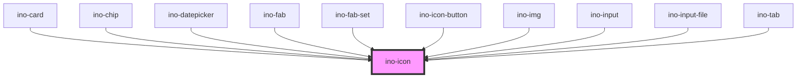

# ino-icon

A light icon component for texts and other components.

### Usage

The component can be used as follows:

```js
document.querySelector('ino-icon').addEventListener('clickEl', (e) => {
  // ...
});
```

```js
document
  .querySelector('ino-icon')
  .addEventListener('clickEl', (_) => alert('The icon was clicked'));
```

```html
<ino-icon ino-icon="<string>" ino-clickable onclickel="handleClickEl()">
</ino-icon>
```

### React

#### Example #1 - Basic

```jsx
import { Component } from 'react';
import { InoIcon } from '@inovex.de/elements/dist/react';

class MyComponent extends Component {
  handleClick = (e: any) => {
    alert(`Icon was clicked`);
  };

  render() {
    return <InoIcon inoIcon="search" inoClickable onClickEl={handleClick} />;
  }
}
```

#### Example #2 - With Types

```jsx
import React, { Component } from 'react';
import { InoIcon } from '@inovex.de/elements/dist/react';
import { Components } from '@inovex.de/elements/dist/types/components';

const Icon: React.FunctionComponent<Components.InoIconAttributes> = (props) => {
  const { inoIcon } = props;

  const handleClick = (e: any) => {
    alert(`Icon was clicked`);
  };

  return (
    <InoIcon inoIcon={inoIcon} onClickEl={handleClick}>
      {props.children}
    </InoIcon>
  );
};

class MyComponent extends Component {
  render() {
    return <Icon inoIcon="search" />;
  }
}
```

## Additional Hints

The component inherits styles, such as the text size, from the parent element. For custom styles, use the css properties of the component.

**Clickable icon:** Make an icon interactive with the optional attribute `ino-clickable`. Clickable icons emit a `clickEl` event.

### Add icons

If you would like to add custom icons, you have to add them to the `src/assets/ino-icon` folder and execute the `yarn icon:integrate-icons`
command to include the newly added icons in the `icons.js` file.

> **Note:** To use the provided icons in your consumer project, you need to copy all contents of
> `node_modules/@inovex.de/elements/dist/inovex-elements/ino-icon` into your `dist/ino-icon` folder. All icons are expected
> to be located in `ino-icon/` at runtime. Please refer to the Storybook documentation to get detailed instructions
> on how to integrate the icons with Angular, React or plain JavaScript.

Alternatively, you can also just provide the URL to your preferred icon by setting the `src` property accordingly.

<!-- Auto Generated Below -->


## Properties

| Property            | Attribute             | Description                                                           | Type      | Default     |
| ------------------- | --------------------- | --------------------------------------------------------------------- | --------- | ----------- |
| `inoClickable`      | `ino-clickable`       | Makes the icon clickable and allows to listen to the `clickEl` event. | `boolean` | `undefined` |
| `inoColorSecondary` | `ino-color-secondary` | Colors the icon in the global secondary color                         | `boolean` | `undefined` |
| `inoIcon`           | `ino-icon`            | The name of the icon of this element or an URL.                       | `string`  | `undefined` |
| `src`               | `src`                 | Specifies the exact `src` of an SVG file to use.                      | `string`  | `undefined` |
| `svgTitle`          | `svg-title`           | Sets a meaningful svg title for assistive technologies.               | `string`  | `undefined` |


## Events

| Event     | Description                                                                                                           | Type               |
| --------- | --------------------------------------------------------------------------------------------------------------------- | ------------------ |
| `clickEl` | Event that emits as soon as the user clicks on the icon. The event only emits if the property `inoClickable` is true. | `CustomEvent<any>` |


## CSS Custom Properties

| Name                         | Description                         |
| ---------------------------- | ----------------------------------- |
| `--ino-icon-color-primary`   | Primary (default) color of the icon |
| `--ino-icon-color-secondary` | Secondary color of the icon         |
| `--ino-icon-height`          | Height of the icon                  |
| `--ino-icon-width`           | Width of the icon                   |


## Dependencies

### Used by

 - [ino-card](../ino-card)
 - [ino-chip](../ino-chip)
 - [ino-datepicker](../ino-datepicker)
 - [ino-fab](../ino-fab)
 - [ino-fab-set](../ino-fab-set)
 - [ino-icon-button](../ino-icon-button)
 - [ino-img](../ino-img)
 - [ino-input](../ino-input)
 - [ino-input-file](../ino-input-file)
 - [ino-tab](../ino-tab)

### Graph


----------------------------------------------

*Built with [StencilJS](https://stenciljs.com/)*
