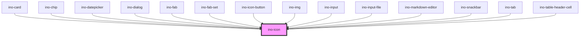

# ino-icon

<!-- Auto Generated Below -->

## Overview

A light icon component for texts and other components.
This component is based on the ionicons (https://github.com/ionic-team/ionicons)

## Properties

| Property         | Attribute         | Description                                                           | Type      | Default     |
| ---------------- | ----------------- | --------------------------------------------------------------------- | --------- | ----------- |
| `clickable`      | `clickable`       | Makes the icon clickable and allows to listen to the `clickEl` event. | `boolean` | `undefined` |
| `colorSecondary` | `color-secondary` | Colors the icon in the global secondary color                         | `boolean` | `undefined` |
| `icon`           | `icon`            | The name of the icon of this element or an URL.                       | `string`  | `undefined` |
| `src`            | `src`             | Specifies the exact `src` of an SVG file to use.                      | `string`  | `undefined` |
| `svgTitle`       | `svg-title`       | Sets a meaningful svg title for assistive technologies.               | `string`  | `undefined` |

## Events

| Event     | Description                                                                                                           | Type               |
| --------- | --------------------------------------------------------------------------------------------------------------------- | ------------------ |
| `clickEl` | Event that emits as soon as the user clicks on the icon. The event only emits if the property `inoClickable` is true. | `CustomEvent<any>` |

## CSS Custom Properties

| Name                | Description        |
| ------------------- | ------------------ |
| `--ino-icon-color`  | Color of the icon  |
| `--ino-icon-height` | Height of the icon |
| `--ino-icon-width`  | Width of the icon  |

## Dependencies

### Used by

 - [ino-card](../ino-card)
 - [ino-chip](../ino-chip)
 - [ino-datepicker](../ino-datepicker)
 - [ino-dialog](../ino-dialog)
 - [ino-fab](../ino-fab)
 - [ino-fab-set](../ino-fab-set)
 - [ino-icon-button](../ino-icon-button)
 - [ino-img](../ino-img)
 - [ino-input](../ino-input)
 - [ino-input-file](../ino-input-file)
 - [ino-markdown-editor](../ino-markdown-editor)
 - [ino-snackbar](../ino-snackbar)
 - [ino-tab](../ino-tab)
 - [ino-table-header-cell](../ino-table-header-cell)

### Graph

----------------------------------------------

*Built with [StencilJS](https://stenciljs.com/)*
