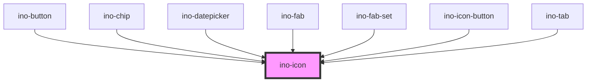

# ino-icon

A light icon component for texts and other components.

### Usage

The component can be used as follows:

```js
document.querySelector('ino-icon').addEventListener('clickEl', e => {
  // ...
});
```

```js
document
  .querySelector('ino-icon')
  .addEventListener('clickEl', _ => alert('The icon was clicked'));
```

```html
<ino-icon ino-icon="<string>" ino-clickable onclickel="handleClickEl()">
</ino-icon>
```

### React

#### Example #1 - Basic

```jsx harmony
import { Component } from 'react';
import { InoIcon } from '@inovex/elements/dist/react';

class MyComponent extends Component {
  handleClick = (e: any) => {
    alert(`Icon was clicked`);
  };

  render() {
    return <InoIcon inoIcon="search" inoClickable onClickEl={handleClick} />;
  }
}
```

#### Example #2 - With Types

```jsx harmony
import React, { Component } from 'react';
import { InoIcon } from '@inovex/elements/dist/react';
import { Components } from '@inovex/elements/dist/types/components';

const Icon: React.FunctionComponent<Components.InoIconAttributes> = props => {
  const { inoIcon } = props;

  const handleClick = (e: any) => {
    alert(`Icon was clicked`);
  };

  return (
    <InoIcon inoIcon={inoIcon} onClickEl={handleClick}>
      {props.children}
    </InoIcon>
  );
};

class MyComponent extends Component {
  render() {
    return <Icon inoIcon="search" />;
  }
}
```

## Additional Hints

The component inherits stylings like the text size of the parent element. For custom stylings set css properties on this element.

**Clickable icon:** Make an icon interactive with the optional attribute `ino-clickable`. Clickable icons emit an `clickEl` event that can be listened to.

### Manage icons

The `icon-assets` folder is an exported [icomoon](https://icomoon.io/) project. This handy app is used to maintain our icons.

If you have to add, remove or change an icon:

1. Manage the Icons in the icomoon App
    1. Import the `selection.json` in the [icomoon app](http://icomoon.io/app/#).
    2. Add, remove, rename, ... the icons
    3. Export the new icon set by clicking on `Generate SVG & More`.

2. Make sure the exported icons have the same structure and the settings in `selection.json` didn't change.

3. Copy&Paste the **entire** `icon-assets` folder and override the old one.

4. Run `yarn icon:integrate-icons`. The new icons will be added to the `icons.js` file and copied to the storybook.

5. Don't forget to update the storybook whenever the API changes.

> **Note:** To use the provided icons in your consumer project, you need to copy all contents of
> `node_modules/@inovex/elements/dist/inovex-elements/icon-assets` into your `dist/icon-assets` folder. All icons are expected
> at runtime to be located in `icon-assets/`. Please refer to the Storybook documentation to get detailed instructions
> how to integrate the icons with Angular, React or plain JavaScript.

### Custom icons

If you need to use custom icons just hand over the URL to your preferred icon.

<!-- Auto Generated Below -->


## Properties

| Property            | Attribute             | Description                                                           | Type      | Default     |
| ------------------- | --------------------- | --------------------------------------------------------------------- | --------- | ----------- |
| `inoClickable`      | `ino-clickable`       | Makes the icon clickable and allows to listen to the `clickEl` event. | `boolean` | `undefined` |
| `inoColorSecondary` | `ino-color-secondary` | Colors the icon in the global secondary color                         | `boolean` | `undefined` |
| `inoIcon`           | `ino-icon`            | The name of the icon of this element or an URL.                       | `string`  | `undefined` |
| `src`               | `src`                 | Specifies the exact `src` of an SVG file to use.                      | `string`  | `undefined` |


## Events

| Event     | Description                                                                                                           | Type               |
| --------- | --------------------------------------------------------------------------------------------------------------------- | ------------------ |
| `clickEl` | Event that emits as soon as the user clicks on the icon. The event only emits if the property `inoClickable` is true. | `CustomEvent<any>` |


## CSS Custom Properties

| Name       | Description        |
| ---------- | ------------------ |
| `--color`  | Color of the icon  |
| `--height` | Height of the icon |
| `--width`  | Width of the icon  |


## Dependencies

### Used by

 - [ino-button](../ino-button)
 - [ino-chip](../ino-chip)
 - [ino-datepicker](../ino-datepicker)
 - [ino-fab](../ino-fab)
 - [ino-fab-set](../ino-fab-set)
 - [ino-icon-button](../ino-icon-button)
 - [ino-tab](../ino-tab)

### Graph


----------------------------------------------

*Built with [StencilJS](https://stenciljs.com/)*
