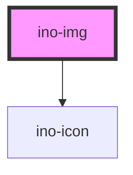

# ino-img

<!-- Auto Generated Below -->

## Overview

An image component with different styles that reserves a predefined space to avoid jumping contents.

## Properties

| Property       | Attribute       | Description                                                                                                                                                                      | Type                          | Default                 |
| -------------- | --------------- | -------------------------------------------------------------------------------------------------------------------------------------------------------------------------------- | ----------------------------- | ----------------------- |
| `alt`          | `alt`           | The alternative text of this image.                                                                                                                                              | `string`                      | `undefined`             |
| `decoding`     | `decoding`      | The decoding method of the native html input element. Can either be `async`, `auto` or `sync`.                                                                                   | `"async" \| "auto" \| "sync"` | `undefined`             |
| `fallbackIcon` | `fallback-icon` | Icon used for fallback image if image can not be loaded                                                                                                                          | `string`                      | `'image_not_available'` |
| `height`       | `height`        | The fixed height of this image.                                                                                                                                                  | `number`                      | `undefined`             |
| `imgListItem`  | `img-list-item` | Indicates that the image is a part of an image list component                                                                                                                    | `boolean`                     | `false`                 |
| `label`        | `label`         | Sets the label of the image. Note: Only works if image is part of an ino-img-list component.                                                                                     | `string`                      | `undefined`             |
| `ratioHeight`  | `ratio-height`  | The ratio height for this image (default = 1). Use this attribute together with `ratio-width` to reserve a space for the image during rendering and to prevent jumping contents. | `number`                      | `1`                     |
| `ratioWidth`   | `ratio-width`   | The ratio width of this image (default = 1). Use this attribute together with `ratio-height` to reserve a space for the image during rendering and to prevent jumping contents.  | `number`                      | `1`                     |
| `rounded`      | `rounded`       | If true, styles the image with rounded borders.                                                                                                                                  | `boolean`                     | `undefined`             |
| `sizes`        | `sizes`         | A set of rules to specify the usage of images sources that are defined in the `srcset` attribute.                                                                                | `string`                      | `undefined`             |
| `src`          | `src`           | The source of this image element.                                                                                                                                                | `string`                      | `undefined`             |
| `srcset`       | `srcset`        | A set of sources of this image for different viewports or devices.                                                                                                               | `string`                      | `undefined`             |
| `usemap`       | `usemap`        | An ID referencing to a defined map element for this image.                                                                                                                       | `string`                      | `undefined`             |
| `width`        | `width`         | The fixed of the image.                                                                                                                                                          | `number`                      | `undefined`             |

## Dependencies

### Depends on

- [ino-icon](../ino-icon)

### Graph

----------------------------------------------

*Built with [StencilJS](https://stenciljs.com/)*
