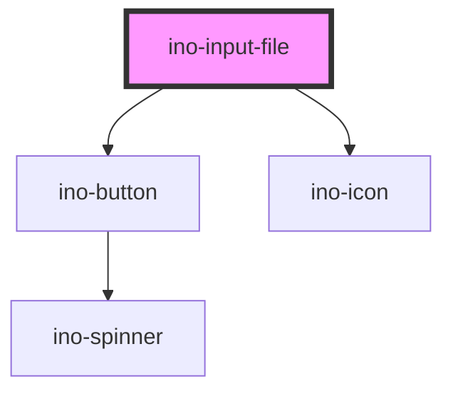

# ino-input-file

<!-- Auto Generated Below -->

## Overview

An input component for files. It functions as a wrapper around the native input capabilities having the [`type="file"`](https://developer.mozilla.org/en-US/docs/Web/HTML/Element/input/file).

This component replaces the native behaviour with a custom `ino-button` with logic.

## Properties

| Property                   | Attribute                      | Description                                                                                                                                          | Type      | Default                  |
| -------------------------- | ------------------------------ | ---------------------------------------------------------------------------------------------------------------------------------------------------- | --------- | ------------------------ |
| `accept`                   | `accept`                       | The types of files accepted by the server.                                                                                                           | `string`  | `undefined`              |
| `autoFocus`                | `autofocus`                    | The autofocus of this element.                                                                                                                       | `boolean` | `undefined`              |
| `disabled`                 | `disabled`                     | Disables this element.                                                                                                                               | `boolean` | `undefined`              |
| `dragAndDrop`              | `drag-and-drop`                | Enables drag-and-drop file input                                                                                                                     | `boolean` | `false`                  |
| `dragAndDropSecondaryText` | `drag-and-drop-secondary-text` | Sets the secondary text of the drag and drop window                                                                                                  | `string`  | `'or'`                   |
| `dragAndDropText`          | `drag-and-drop-text`           | Sets the primary text of the drag and drop window                                                                                                    | `string`  | `'Drag your files here'` |
| `error`                    | `error`                        | Displays the element as invalid if set to true. This functionality might be useful if the input validation is (additionally) handled by the backend. | `boolean` | `undefined`              |
| `helperText`               | `helper-text`                  | The optional helper text.                                                                                                                            | `string`  | `undefined`              |
| `helperTextPersistent`     | `helper-text-persistent`       | Displays the helper permanently.                                                                                                                     | `boolean` | `undefined`              |
| `helperTextValidation`     | `helper-text-validation`       | Styles the helper text as a validation message.                                                                                                      | `boolean` | `undefined`              |
| `label`                    | `label`                        | Sets the label of the select files button.                                                                                                           | `string`  | `'Select file'`          |
| `multiple`                 | `multiple`                     | Indicates whether the user can enter one or more values.                                                                                             | `boolean` | `undefined`              |
| `name`                     | `name`                         | The name of this input field.                                                                                                                        | `string`  | `undefined`              |
| `required`                 | `required`                     | Marks this element as required.                                                                                                                      | `boolean` | `undefined`              |
| `showLabelHint`            | `show-label-hint`              | If true, an *optional* message is displayed if not required, otherwise a * marker is displayed if required                                           | `boolean` | `undefined`              |

## Events

| Event        | Description                   | Type                                      |
| ------------ | ----------------------------- | ----------------------------------------- |
| `changeFile` | Emits when the value changes. | `CustomEvent<{ e: any; files: File[]; }>` |

## Methods

### `setBlur() => Promise<void>`

Sets blur on the native `input`.
Use this method instead of the global `input.blur()`.

#### Returns

Type: `Promise<void>`

### `setFocus() => Promise<void>`

Sets focus on the native `input`.
Use this method instead of the global `input.focus()`.

#### Returns

Type: `Promise<void>`

## CSS Custom Properties

| Name                          | Description                        |
| ----------------------------- | ---------------------------------- |
| `--ino-input-file-box-height` | Height of the drag and drop window |
| `--ino-input-file-box-width`  | Width of the drag and drop window  |

## Dependencies

### Depends on

- [ino-button](../ino-button)
- [ino-icon](../ino-icon)

### Graph

----------------------------------------------

*Built with [StencilJS](https://stenciljs.com/)*
