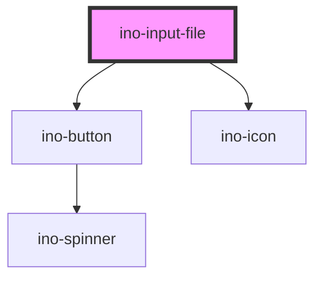

# ino-input-file

<!-- Auto Generated Below -->

## Properties

| Property                   | Attribute                      | Description                                              | Type      | Default                  |
| -------------------------- | ------------------------------ | -------------------------------------------------------- | --------- | ------------------------ |
| `accept`                   | `accept`                       | The types of files accepted by the server.               | `string`  | `undefined`              |
| `autoFocus`                | `autofocus`                    | The autofocus of this element.                           | `boolean` | `undefined`              |
| `disabled`                 | `disabled`                     | Disables this element.                                   | `boolean` | `undefined`              |
| `dragAndDrop`              | `drag-and-drop`                | Enables drag-and-drop file input                         | `boolean` | `false`                  |
| `dragAndDropSecondaryText` | `drag-and-drop-secondary-text` | Sets the secondary text of the drag and drop window      | `string`  | `'or'`                   |
| `dragAndDropText`          | `drag-and-drop-text`           | Sets the primary text of the drag and drop window        | `string`  | `'Drag your files here'` |
| `label`                    | `label`                        | Sets the label of the select files button.               | `string`  | `'Select file'`          |
| `multiple`                 | `multiple`                     | Indicates whether the user can enter one or more values. | `boolean` | `undefined`              |
| `name`                     | `name`                         | The name of this input field.                            | `string`  | `undefined`              |
| `required`                 | `required`                     | Marks this element as required.                          | `boolean` | `undefined`              |

## Events

| Event        | Description                   | Type                                      |
| ------------ | ----------------------------- | ----------------------------------------- |
| `changeFile` | Emits when the value changes. | `CustomEvent<{ e: any; files: File[]; }>` |

## Dependencies

### Depends on

- [ino-button](../ino-button)
- [ino-icon](../ino-icon)

### Graph

----------------------------------------------

*Built with [StencilJS](https://stenciljs.com/)*
