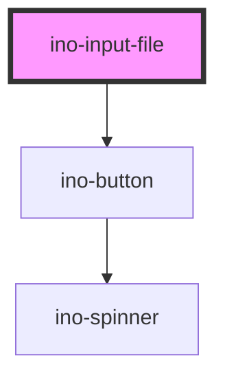

# ino-input-file

An input component for files. It functions as a wrapper around the native input capabilities having the [`type="file"`](https://developer.mozilla.org/en-US/docs/Web/HTML/Element/input/file).

This component replaces the native behaviour with a custom `ino-button` with logic.

### Usage

The component can be used as follows:

```js
document
  .querySelector('ino-datepicker')
  .addEventListener('changeFile', e => alert(`The new file is: ${e.detail}`));
```

```html
<ino-input-file
  accept="<string>"
  autofocus
  disabled
  multiple
  name="<string>"
  required

  ino-label="<string>"
>
</ino-input>
```

### React

#### Example #1 - Basic

```js
import { Component } from 'react';
import { InoInputFile } from '@inovex/elements/dist/react';

class MyComponent extends Component {
  onChangeFile(e: any) {
    alert(`The new file is: ${e.detail}`);
  }

  render() {
    return <InoInputFile onChangeFile={onChangeFile} />;
  }
}
```

#### Example #2 - With Types

```js
import React, { Component } from 'react';
import { InoInputFile } from '@inovex/elements/dist/react';
import { Components } from '@inovex/elements/dist/types/components';

const FileInput: React.FunctionComponent<Components.InoInputFile> = props => {
  const onFileChange = (e: any) => {
    alert(`The new file is: ${e.detail}`);
  };

  return <InoInputFile onFileChange={onFileChange} />;
};

class MyComponent extends Component {
  render() {
    return <FileInput />;
  }
}
```

## Additional Hints

<!-- Auto Generated Below -->


## Properties

| Property    | Attribute   | Description                                              | Type      | Default         |
| ----------- | ----------- | -------------------------------------------------------- | --------- | --------------- |
| `accept`    | `accept`    | The types of files accepted by the server.               | `string`  | `undefined`     |
| `autoFocus` | `autofocus` | The autofocus of this element.                           | `boolean` | `undefined`     |
| `disabled`  | `disabled`  | Disables this element.                                   | `boolean` | `undefined`     |
| `inoLabel`  | `ino-label` | Sets the label of the select files button.               | `string`  | `'Select file'` |
| `multiple`  | `multiple`  | Indicates whether the user can enter one or more values. | `boolean` | `undefined`     |
| `name`      | `name`      | The name of this input field.                            | `string`  | `undefined`     |
| `required`  | `required`  | Marks this element as required.                          | `boolean` | `undefined`     |


## Events

| Event        | Description                   | Type                                        |
| ------------ | ----------------------------- | ------------------------------------------- |
| `changeFile` | Emits when the value changes. | `CustomEvent<{ e: any; files: object[]; }>` |


## Dependencies

### Depends on

- [ino-button](../ino-button)

### Graph


----------------------------------------------

*Built with [StencilJS](https://stenciljs.com/)*
