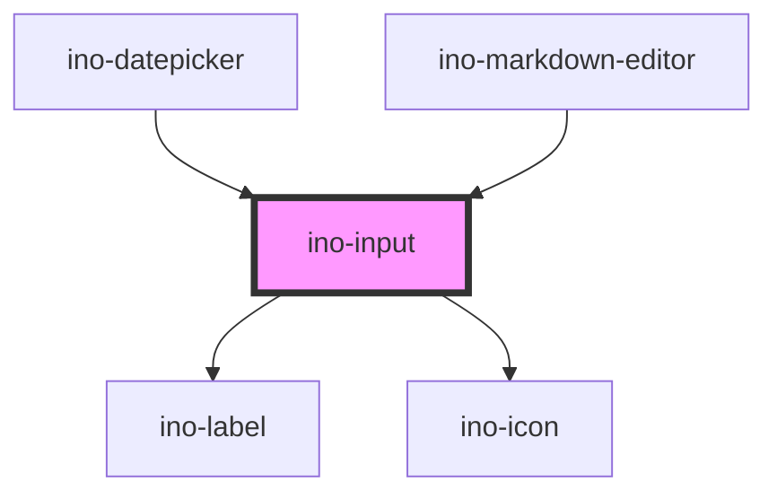

# ino-input

An input component with styles. It functions as a wrapper around the material [textfield](https://github.com/material-components/material-components-web/tree/master/packages/mdc-textfield) component.

Use this element for **simple types** like `text`, `password`, `number` or `email`. For more complex types, there are elements like a [Radio Button](../ino-radio), a [Checkbox](../ino-checkbox), a [Datepicker](../ino-datepicker) and many more.

### Usage

The component can be used as follows:

```js
document
  .querySelector('ino-input')
  .addEventListener('valueChange', (e) =>
    alert(`The new input value is: ${e.detail}`),
  );
```

```html
<ino-input
  autocomplete="<string>"
  autofocus
  disabled
  min="<string>"
  max="<string>"
  step="<number>"
  name="<string>"
  pattern="<string>"
  placeholder="<string>"
  required
  size="<number>"
  type="<string>"
  value="<string>"
  error
  outline
  label="<string>"
  helper="<string>"
  helper-persistent
  helper-validation
  data-list="<string>"
>
  <datalist id="<string>">
    <option>...</option>
  </datalist>
  <ino-icon slot="icon-leading" icon="..."></ino-icon>
  <ino-icon slot="icon-trailing" icon="..."></ino-icon>
</ino-input>
```

### React

#### Example #1 - Basic

```js
import { Component } from 'react';
import { InoInput } from '@inovex.de/elements/dist/react';

class MyComponent extends Component {
  onValueChange(e: any) {
    alert(`The new value is ${e.detail}`);
  }

  render() {
    return (
      <InoInput
        placeholder="You can insert some text..."
        onValueChange={onValueChange}
      />
    );
  }
}
```

#### Example #2 - With Types

```js
import React, { Component } from 'react';
import { InoInput } from '@inovex.de/elements/dist/react';
import { Components } from '@inovex.de/elements/dist/types/components';

const Input: React.FunctionComponent<Components.InoInputAttributes> = (
  props,
) => {
  const onValueChange = (e: any) => {
    alert(`The new value is ${e.detail}`);
  };

  return (
    <InoInput
      placeholder="You can insert some text..."
      onValueChange={onValueChange}
    />
  );
};

class MyComponent extends Component {
  render() {
    return <Input placeholder="You can insert some text..." />;
  }
}
```

## Additional Hints

**Outlined**: The component is by default a box component with ripple underline. Provide `outline` to use the material outline design.

**Labels**: The component shows a floating label containing the value of `label`.

**Helper Text**: The component shows an optional helper text underneath the input field (`helper`). By default, the helper text will be visible as soon as the user focuses on the input field. Set `helper-persistent` to show it all the time. Furthermore, use `helper-validation` to style the helper text as validation message.

**Icons**: There are currently two options two place an icon: at the start/left (`icon-leading`) or at the end/right (`icon-trailing`). To specify an icon, use either the `ino-icon`-Component (preferred) or use an icon of your choice and place it inside the `ino-input`-Element. Additionally, you have to provide either `slot="icon-leading"` or `slot="icon-trailing"`to your icon element.

**Datalist**: Provide the id of the datalist child and a list with possible selectable values will be displayed and filtered with every keystroke. See [datalist](https://developer.mozilla.org/de/docs/Web/HTML/Element/datalist) for more information.

### Control flow

The input has a controlled (unmanaged) attribute `value`. For this reason, the value doesn't change on user interaction but on updates of `value`. Listen to `valueChange`, sync it with your local state and pass the new value to the component again to change value of input.

```js
document.querySelector('ino-input').addEventListener('valueChange', (e) => {
  // ...
});
```

```html
<ino-input value="Here's some text"></ino-input>
```

### Event Behaviour

The component is based on a native input with additional features. Thus, the component bubbles events triggered by the native [HTMLInputElement](https://developer.mozilla.org/en-US/docs/Web/API/HTMLInputElement) like `keyup`. The native `input` and `change` event is not bubbled because the value will only change when the value attribute changes.

<!-- Auto Generated Below -->


## Properties

| Property                 | Attribute                  | Description                                                                                                                                                                                                                                               | Type                                                                                             | Default     |
| ------------------------ | -------------------------- | --------------------------------------------------------------------------------------------------------------------------------------------------------------------------------------------------------------------------------------------------------- | ------------------------------------------------------------------------------------------------ | ----------- |
| `autoFocus`              | `auto-focus`               | The autofocus of this element.                                                                                                                                                                                                                            | `boolean`                                                                                        | `undefined` |
| `autocomplete`           | `autocomplete`             | The autocomplete property of this element.                                                                                                                                                                                                                | `string`                                                                                         | `undefined` |
| `dataList`               | `data-list`                | The id of the datalist child                                                                                                                                                                                                                              | `string`                                                                                         | `undefined` |
| `disabled`               | `disabled`                 | Disables this element.                                                                                                                                                                                                                                    | `boolean`                                                                                        | `undefined` |
| `error`                  | `error`                    | Displays the input field as invalid if set to true. If the property is not set or set to false, the validation is handled by the `pattern` property. This functionality might be useful if the input validation is (additionally) handled by the backend. | `boolean`                                                                                        | `undefined` |
| `helper`                 | `helper`                   | The optional helper text.                                                                                                                                                                                                                                 | `string`                                                                                         | `undefined` |
| `helperCharacterCounter` | `helper-character-counter` | Displays the number of characters. The maxlength-property must be set. This helper text will be displayed persistently.                                                                                                                                   | `boolean`                                                                                        | `undefined` |
| `helperPersistent`       | `helper-persistent`        | Displays the helper permanently.                                                                                                                                                                                                                          | `boolean`                                                                                        | `undefined` |
| `helperValidation`       | `helper-validation`        | Styles the helper text as a validation message.                                                                                                                                                                                                           | `boolean`                                                                                        | `undefined` |
| `label`                  | `label`                    | The optional floating label of this input field.                                                                                                                                                                                                          | `string`                                                                                         | `undefined` |
| `max`                    | `max`                      | The max value of this element.                                                                                                                                                                                                                            | `string`                                                                                         | `undefined` |
| `maxlength`              | `maxlength`                | Limits the number of possible characters to the given number                                                                                                                                                                                              | `number`                                                                                         | `undefined` |
| `min`                    | `min`                      | The min value of this element.                                                                                                                                                                                                                            | `string`                                                                                         | `undefined` |
| `name`                   | `name`                     | The name of this element.                                                                                                                                                                                                                                 | `string`                                                                                         | `undefined` |
| `outline`                | `outline`                  | Styles the input field as outlined element.                                                                                                                                                                                                               | `boolean`                                                                                        | `undefined` |
| `pattern`                | `pattern`                  | The validation pattern of this element.                                                                                                                                                                                                                   | `string`                                                                                         | `undefined` |
| `placeholder`            | `placeholder`              | The placeholder of this element.                                                                                                                                                                                                                          | `string`                                                                                         | `undefined` |
| `required`               | `required`                 | Marks this element as required.                                                                                                                                                                                                                           | `boolean`                                                                                        | `undefined` |
| `showLabelHint`          | `show-label-hint`          | If true, an *optional* message is displayed if not required, otherwise a * marker is displayed if required                                                                                                                                                | `boolean`                                                                                        | `undefined` |
| `step`                   | `step`                     | The step value of this element. Use `any` for decimal numbers                                                                                                                                                                                             | `"any" \| number`                                                                                | `1`         |
| `type`                   | `type`                     | The type of this element (default = text).                                                                                                                                                                                                                | `"color" \| "email" \| "number" \| "password" \| "search" \| "tel" \| "text" \| "url" \| "week"` | `'text'`    |
| `unit`                   | `unit`                     | Displays the given unit at the end of the input field.                                                                                                                                                                                                    | `string`                                                                                         | `undefined` |
| `value`                  | `value`                    | The value of this element. (**unmanaged**)                                                                                                                                                                                                                | `string`                                                                                         | `''`        |


## Events

| Event         | Description                                                                    | Type                  |
| ------------- | ------------------------------------------------------------------------------ | --------------------- |
| `inoBlur`     | Emits when the input field is blurred and validates email input                | `CustomEvent<void>`   |
| `inoFocus`    | Emits when the input field is focused                                          | `CustomEvent<void>`   |
| `valueChange` | Emits when the user types something in. Contains typed input in `event.detail` | `CustomEvent<string>` |


## Methods

### `getInputElement() => Promise<HTMLInputElement>`

Returns the native input element used under the hood.

#### Returns

Type: `Promise<HTMLInputElement>`


### `setBlur() => Promise<void>`

Sets blur on the native `input`.
Use this method instead of the global `input.blur()`.

#### Returns

Type: `Promise<void>`


### `setFocus() => Promise<void>`

Sets focus on the native `input`.
Use this method instead of the global `input.focus()`.

#### Returns

Type: `Promise<void>`


## Slots

| Slot              | Description                  |
| ----------------- | ---------------------------- |
| `"icon-leading"`  | For the icon to be prepended |
| `"icon-trailing"` | For the icon to be appended  |


## CSS Custom Properties

| Name                      | Description             |
| ------------------------- | ----------------------- |
| `--ino-input-caret-color` | color of the caret      |
| `--ino-input-color`       | text color of the input |
| `--ino-input-icon-color`  | icon color              |
| `--ino-input-label-color` | color of the label      |
| `--ino-input-line-color`  | line color              |


## Dependencies

### Used by

 - [ino-datepicker](../ino-datepicker)
 - [ino-markdown-editor](../ino-markdown-editor)

### Depends on

- [ino-label](../ino-label)
- [ino-icon](../ino-icon)

### Graph


----------------------------------------------

*Built with [StencilJS](https://stenciljs.com/)*
