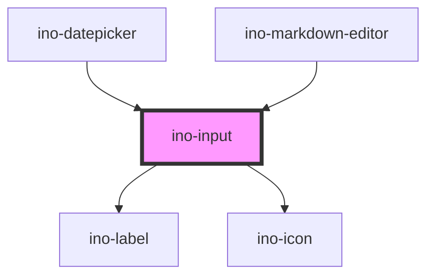

# ino-input

<!-- Auto Generated Below -->

## Properties

| Property                 | Attribute                  | Description                                                                                                                                                                                                                                               | Type                                                                                             | Default     |
| ------------------------ | -------------------------- | --------------------------------------------------------------------------------------------------------------------------------------------------------------------------------------------------------------------------------------------------------- | ------------------------------------------------------------------------------------------------ | ----------- |
| `autoFocus`              | `auto-focus`               | The autofocus of this element.                                                                                                                                                                                                                            | `boolean`                                                                                        | `undefined` |
| `autocomplete`           | `autocomplete`             | The autocomplete property of this element.                                                                                                                                                                                                                | `string`                                                                                         | `undefined` |
| `dataList`               | `data-list`                | The id of the datalist child                                                                                                                                                                                                                              | `string`                                                                                         | `undefined` |
| `disabled`               | `disabled`                 | Disables this element.                                                                                                                                                                                                                                    | `boolean`                                                                                        | `undefined` |
| `error`                  | `error`                    | Displays the input field as invalid if set to true. If the property is not set or set to false, the validation is handled by the `pattern` property. This functionality might be useful if the input validation is (additionally) handled by the backend. | `boolean`                                                                                        | `undefined` |
| `helper`                 | `helper`                   | The optional helper text.                                                                                                                                                                                                                                 | `string`                                                                                         | `undefined` |
| `helperCharacterCounter` | `helper-character-counter` | Displays the number of characters. The maxlength-property must be set. This helper text will be displayed persistently.                                                                                                                                   | `boolean`                                                                                        | `undefined` |
| `helperPersistent`       | `helper-persistent`        | Displays the helper permanently.                                                                                                                                                                                                                          | `boolean`                                                                                        | `undefined` |
| `helperValidation`       | `helper-validation`        | Styles the helper text as a validation message.                                                                                                                                                                                                           | `boolean`                                                                                        | `undefined` |
| `label`                  | `label`                    | The optional floating label of this input field.                                                                                                                                                                                                          | `string`                                                                                         | `undefined` |
| `max`                    | `max`                      | The max value of this element.                                                                                                                                                                                                                            | `string`                                                                                         | `undefined` |
| `maxlength`              | `maxlength`                | Limits the number of possible characters to the given number                                                                                                                                                                                              | `number`                                                                                         | `undefined` |
| `min`                    | `min`                      | The min value of this element.                                                                                                                                                                                                                            | `string`                                                                                         | `undefined` |
| `name`                   | `name`                     | The name of this element.                                                                                                                                                                                                                                 | `string`                                                                                         | `undefined` |
| `outline`                | `outline`                  | Styles the input field as outlined element.                                                                                                                                                                                                               | `boolean`                                                                                        | `undefined` |
| `pattern`                | `pattern`                  | The validation pattern of this element.                                                                                                                                                                                                                   | `string`                                                                                         | `undefined` |
| `placeholder`            | `placeholder`              | The placeholder of this element.                                                                                                                                                                                                                          | `string`                                                                                         | `undefined` |
| `required`               | `required`                 | Marks this element as required.                                                                                                                                                                                                                           | `boolean`                                                                                        | `undefined` |
| `showLabelHint`          | `show-label-hint`          | If true, an *optional* message is displayed if not required, otherwise a * marker is displayed if required                                                                                                                                                | `boolean`                                                                                        | `undefined` |
| `step`                   | `step`                     | The step value of this element. Use `any` for decimal numbers                                                                                                                                                                                             | `"any" \| number`                                                                                | `1`         |
| `type`                   | `type`                     | The type of this element (default = text).                                                                                                                                                                                                                | `"color" \| "email" \| "number" \| "password" \| "search" \| "tel" \| "text" \| "url" \| "week"` | `'text'`    |
| `unit`                   | `unit`                     | Displays the given unit at the end of the input field.                                                                                                                                                                                                    | `string`                                                                                         | `undefined` |
| `value`                  | `value`                    | The value of this element. (**unmanaged**)                                                                                                                                                                                                                | `string`                                                                                         | `''`        |

## Events

| Event         | Description                                                                    | Type                  |
| ------------- | ------------------------------------------------------------------------------ | --------------------- |
| `inoBlur`     | Emits when the input field is blurred and validates email input                | `CustomEvent<void>`   |
| `inoFocus`    | Emits when the input field is focused                                          | `CustomEvent<void>`   |
| `valueChange` | Emits when the user types something in. Contains typed input in `event.detail` | `CustomEvent<string>` |

## Methods

### `getInputElement() => Promise<HTMLInputElement>`

Returns the native input element used under the hood.

#### Returns

Type: `Promise<HTMLInputElement>`

### `setBlur() => Promise<void>`

Sets blur on the native `input`.
Use this method instead of the global `input.blur()`.

#### Returns

Type: `Promise<void>`

### `setFocus() => Promise<void>`

Sets focus on the native `input`.
Use this method instead of the global `input.focus()`.

#### Returns

Type: `Promise<void>`

## Slots

| Slot              | Description                                                                                                                                                                                                                                                                                                                                                                                                                                                                               |
| ----------------- | ----------------------------------------------------------------------------------------------------------------------------------------------------------------------------------------------------------------------------------------------------------------------------------------------------------------------------------------------------------------------------------------------------------------------------------------------------------------------------------------- |
| `"icon-leading"`  | For the icon to be prepended                                                                                                                                                                                                                                                                                                                                                                                                                                                              |
| `"icon-trailing"` | For the icon to be appended  An input component with styles. It functions as a wrapper around the material [textfield](https://github.com/material-components/material-components-web/tree/master/packages/mdc-textfield) component.  Use this element for **simple types** like `text`, `password`, `number` or `email`. For more complex types, there are elements like a [Radio Button](../ino-radio), a [Checkbox](../ino-checkbox), a [Datepicker](../ino-datepicker) and many more. |

## Dependencies

### Used by

 - [ino-datepicker](../ino-datepicker)
 - [ino-markdown-editor](../ino-markdown-editor)

### Depends on

- [ino-label](../ino-label)
- [ino-icon](../ino-icon)

### Graph

----------------------------------------------

*Built with [StencilJS](https://stenciljs.com/)*
