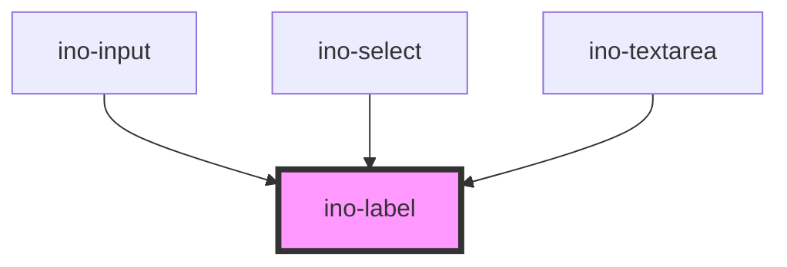

# ino-label

This is an internally used component for various sorts of inputs like `ino-input`, `ino-select` and `ino-textarea`. It is used to display the label for each respective component.

```html
<ino-label
  ino-outline="<boolean>"
  ino-label="<string>"
  ino-required="<boolean>"
  ino-disabled="<boolean>"
>
</ino-label>
```

<!-- Auto Generated Below -->

## Properties

| Property      | Attribute       | Description                                                                         | Type      | Default     |
| ------------- | --------------- | ----------------------------------------------------------------------------------- | --------- | ----------- |
| `inoDisabled` | `ino-disabled`  | Colors the label in an light grey to indicate the disabled status for this element  | `boolean` | `undefined` |
| `inoOutline`  | `ino-outline`   | Styles the label in an outlined style                                               | `boolean` | `undefined` |
| `inoRequired` | `ino-required`  | Appends \* to the label to make it appear as an required input in a form            | `boolean` | `undefined` |
| `inoShowHint` | `ino-show-hint` | Shows a "optional" message, when not inoRequired; Shows a \* mark, when inoRequired | `boolean` | `undefined` |
| `inoText`     | `ino-text`      | The text of the label itself                                                        | `string`  | `undefined` |

## Dependencies

### Used by

- [ino-input](../ino-input)
- [ino-select](../ino-select)
- [ino-textarea](../ino-textarea)

### Graph



---

_Built with [StencilJS](https://stenciljs.com/)_
