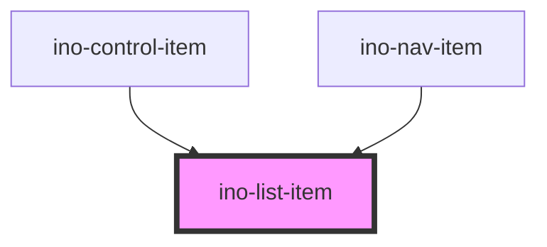

# ino-list-item

<!-- Auto Generated Below -->

## Overview

A list item component that displays a single instance of choice in a list or menu. It functions as a wrapper around the material [list item](https://github.com/material-components/material-components-web/blob/master/packages/mdc-list/) capabilities.

This component is used as child of `ino-list` and `ino-menu` components.

## Properties

| Property        | Attribute        | Description                                                                                                                                      | Type                            | Default     |
| --------------- | ---------------- | ------------------------------------------------------------------------------------------------------------------------------------------------ | ------------------------------- | ----------- |
| `activated`     | `activated`      | Styles the row in an activated style.  In contrast to `selected`, use this for only one item and to mark it as permantently activated.           | `boolean`                       | `undefined` |
| `attrs`         | --               | Allows the specification of native HTML attributes on the underlying HTML element                                                                | `HTMLAttributes<HTMLLIElement>` | `undefined` |
| `disabled`      | `disabled`       | Styles the row in a disabled style.                                                                                                              | `boolean`                       | `undefined` |
| `secondaryText` | `secondary-text` | Sets the secondary text of this list item.  Requires `two-lines` on the parent `ino-list` element.                                               | `string`                        | `undefined` |
| `selected`      | `selected`       | Styles the row in a selected style.  In contrast to `activated`, use this option to select one or multiple items that are likely to change soon. | `boolean`                       | `undefined` |
| `text`          | `text`           | The primary text of this list item.                                                                                                              | `string`                        | `undefined` |

## Events

| Event     | Description                                                                                                                                     | Type               |
| --------- | ----------------------------------------------------------------------------------------------------------------------------------------------- | ------------------ |
| `clickEl` | Emits when the list item is clicked or the enter/space key if pressed while the item is in focus. Contains the element itself in `event.detail` | `CustomEvent<any>` |

## Slots

| Slot          | Description                                        |
| ------------- | -------------------------------------------------- |
| `"leading"`   | For the element to be prepended                    |
| `"primary"`   | For the (text) element                             |
| `"secondary"` | For the secondary text element in a two-lined list |
| `"trailing"`  | For the element to be appended                     |

## CSS Custom Properties

| Name                                                 | Description                                           |
| ---------------------------------------------------- | ----------------------------------------------------- |
| `--ino-list-item-deselected-background-color`        | Background color of a deselected list item            |
| `--ino-list-item-deselected-background-color-active` | Background color of a deselected list item if active  |
| `--ino-list-item-deselected-background-color-focus`  | Background color of a deselected list item if focused |
| `--ino-list-item-deselected-background-color-hover`  | Background color of a deselected list item on hover   |
| `--ino-list-item-deselected-color`                   | Text color of a deselected list item                  |
| `--ino-list-item-selected-background-color`          | Background color of a selected list item              |
| `--ino-list-item-selected-background-color-active`   | Background color of a selected list item if active    |
| `--ino-list-item-selected-background-color-focus`    | Background color of a selected list item if focused   |
| `--ino-list-item-selected-background-color-hover`    | Background color of a selected list item on hover     |
| `--ino-list-item-selected-color`                     | Text color of a selected list item                    |

## Dependencies

### Used by

 - [ino-control-item](../ino-control-item)
 - [ino-nav-item](../ino-nav-item)

### Graph

----------------------------------------------

*Built with [StencilJS](https://stenciljs.com/)*
