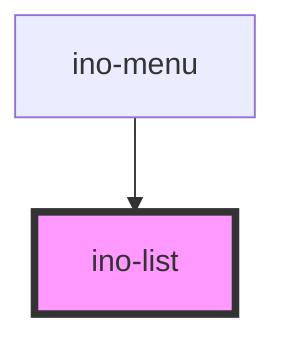

# ino-list

<!-- Auto Generated Below -->

## Properties

| Property   | Attribute   | Description                                                                                                                        | Type      | Default     |
| ---------- | ----------- | ---------------------------------------------------------------------------------------------------------------------------------- | --------- | ----------- |
| `avatar`   | `avatar`    | Configures the leading tiles of each row to display images instead of icons. This will make the graphics of the list items larger. | `boolean` | `false`     |
| `dense`    | `dense`     | Styles the list more dense, making it appear more compact.                                                                         | `boolean` | `undefined` |
| `twoLines` | `two-lines` | Marks this element as list with items having two lines.                                                                            | `boolean` | `undefined` |

## Slots

| Slot        | Description                                                                                                                                                                                                                                                                                                                                                                                         |
| ----------- | --------------------------------------------------------------------------------------------------------------------------------------------------------------------------------------------------------------------------------------------------------------------------------------------------------------------------------------------------------------------------------------------------- |
| `"default"` | One or more `ino-(control\|list\|nav)-item` and `ino-list-divider`  A component that displays a list of choices. It functions as a wrapper around the material [list](https://github.com/material-components/material-components-web/blob/master/packages/mdc-list/) component.  This component is a composer to configure and wrap `list-item`s, `list-divider`s, `control-item`s and `nav-item`s. |

## Dependencies

### Used by

 - [ino-menu](../ino-menu)

### Graph

----------------------------------------------

*Built with [StencilJS](https://stenciljs.com/)*
