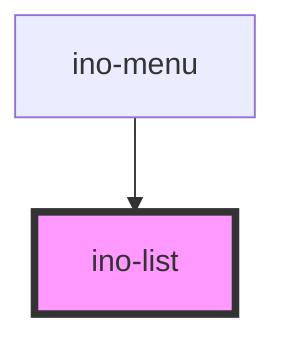

# ino-list

A component that displays a list of choices. It functions as a wrapper around the material [list](https://github.com/material-components/material-components-web/blob/master/packages/mdc-list/) component.

This component is a composer to configure and wrap `list-item`s, `list-divider`s, `control-item`s and `nav-item`s.

### Usage

The component can be used as follows:

```html
<ino-list ino-dense ino-two-lines>
  <ino-list-item ...></ino-list-item>
  <ino-list-divider></ino-list-divider>
  <ino-control-item ...></ino-control-item>
  <ino-nav-item ...></ino-nav-item>
</ino-list>
```

### React

#### Example #1 - Basic

```js
import { Component } from 'react';
import { InoListItem, InoList, InoImg } from '@inovex/elements/dist/react';

class MyComponent extends Component {
  render() {
    return (
      <InoList inoAvatar>
        <InoListItem inoText="First text item">
          <InoImg
            slot="ino-leading"
            src="https://cdn-images-1.medium.com/max/1600/1*HP8l7LMMt7Sh5UoO1T-yLQ.png"
            ino-ratio-width="1"
            ino-ratio-height="1"
          />
        </InoListItem>
        <InoListItem inoText="Second text item">
          <InoImg
            slot="ino-leading"
            src="https://cdn-images-1.medium.com/max/1600/1*HP8l7LMMt7Sh5UoO1T-yLQ.png"
            ino-ratio-width="1"
            ino-ratio-height="1"
          />
        </InoListItem>
      </InoList>
    );
  }
}
```

#### Example #2 - With Types

```js
import React, { Component } from 'react';
import { InoListItem, InoList, InoImg } from '@inovex/elements/dist/react';
import { Components } from '@inovex/elements/dist/types/components';

const List: React.FunctionComponent<Components.InoListAttributes> = props => {
  const { inoAvatar } = props;

  return <InoList inoAvatar={inoAvatar}>{props.children}</InoList>;
};

class MyComponent extends Component {
  render() {
    return (
      <List inoAvatar>
        <InoListItem inoText="First text item">
          <InoImg
            slot="ino-leading"
            src="https://cdn-images-1.medium.com/max/1600/1*HP8l7LMMt7Sh5UoO1T-yLQ.png"
            ino-ratio-width="1"
            ino-ratio-height="1"
          />
        </InoListItem>
        <InoListItem inoText="Second text item">
          <InoImg
            slot="ino-leading"
            src="https://cdn-images-1.medium.com/max/1600/1*HP8l7LMMt7Sh5UoO1T-yLQ.png"
            ino-ratio-width="1"
            ino-ratio-height="1"
          />
        </InoListItem>
      </List>
    );
  }
}
```

## Additional Hints

Provide `ino-two-lines` to set propper style attributes for list items having a primary and secondary line.

<!-- Auto Generated Below -->


## Properties

| Property      | Attribute       | Description                                                                                                                        | Type      | Default     |
| ------------- | --------------- | ---------------------------------------------------------------------------------------------------------------------------------- | --------- | ----------- |
| `inoAvatar`   | `ino-avatar`    | Configures the leading tiles of each row to display images instead of icons. This will make the graphics of the list items larger. | `boolean` | `false`     |
| `inoDense`    | `ino-dense`     | Styles the list more dense, making it appear more compact.                                                                         | `boolean` | `undefined` |
| `inoTwoLines` | `ino-two-lines` | Marks this element as list with items having two lines.                                                                            | `boolean` | `undefined` |


## Dependencies

### Used by

 - [ino-menu](../ino-menu)

### Graph


----------------------------------------------

*Built with [StencilJS](https://stenciljs.com/)*
