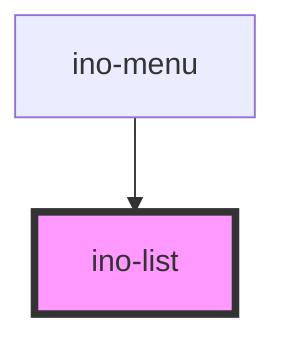

# ino-list

A component that displays a list of choices. It functions as a wrapper around the material [list](https://github.com/material-components/material-components-web/blob/master/packages/mdc-list/) component.

This component is a composer to configure and wrap `list-item`s, `list-divider`s, `control-item`s and `nav-item`s.

### Usage

The component can be used as follows:

```html
<ino-list dense two-lines>
  <ino-list-item ...></ino-list-item>
  <ino-list-divider></ino-list-divider>
  <ino-control-item ...></ino-control-item>
  <ino-nav-item ...></ino-nav-item>
</ino-list>
```

### React

#### Example #1 - Basic

```js
import { Component } from 'react';
import { InoListItem, InoList, InoImg } from '@inovex.de/elements/dist/react';

class MyComponent extends Component {
  render() {
    return (
      <InoList avatar>
        <InoListItem text="First text item">
          <InoImg
            slot="leading"
            src="https://cdn-images-1.medium.com/max/1600/1*HP8l7LMMt7Sh5UoO1T-yLQ.png"
            ratio-width="1"
            ratio-height="1"
          />
        </InoListItem>
        <InoListItem text="Second text item">
          <InoImg
            slot="leading"
            src="https://cdn-images-1.medium.com/max/1600/1*HP8l7LMMt7Sh5UoO1T-yLQ.png"
            ratio-width="1"
            ratio-height="1"
          />
        </InoListItem>
      </InoList>
    );
  }
}
```

#### Example #2 - With Types

```js
import React, { Component } from 'react';
import { InoListItem, InoList, InoImg } from '@inovex.de/elements/dist/react';
import { Components } from '@inovex.de/elements/dist/types/components';

const List: React.FunctionComponent<Components.InoListAttributes> = (props) => {
  const { avatar } = props;

  return <InoList avatar={avatar}>{props.children}</InoList>;
};

class MyComponent extends Component {
  render() {
    return (
      <List avatar>
        <InoListItem text="First text item">
          <InoImg
            slot="leading"
            src="https://cdn-images-1.medium.com/max/1600/1*HP8l7LMMt7Sh5UoO1T-yLQ.png"
            ratio-width="1"
            ratio-height="1"
          />
        </InoListItem>
        <InoListItem text="Second text item">
          <InoImg
            slot="leading"
            src="https://cdn-images-1.medium.com/max/1600/1*HP8l7LMMt7Sh5UoO1T-yLQ.png"
            ratio-width="1"
            ratio-height="1"
          />
        </InoListItem>
      </List>
    );
  }
}
```

## Additional Hints

Provide `two-lines` to set proper style attributes for list items having a primary and secondary line.

<!-- Auto Generated Below -->


## Properties

| Property      | Attribute     | Description                                          | Type                            | Default  |
| ------------- | ------------- | ---------------------------------------------------- | ------------------------------- | -------- |
| `multiselect` | `multiselect` | For a11y: Set to true if list allows multi-selection | `boolean`                       | `false`  |
| `role`        | `role`        | For a11y: If list is interactive then set role type  | `"list" \| "listbox" \| "menu"` | `'list'` |


## Slots

| Slot        | Description                                                        |
| ----------- | ------------------------------------------------------------------ |
| `"default"` | One or more `ino-(control\|list\|nav)-item` and `ino-list-divider` |


## Dependencies

### Used by

 - [ino-menu](../ino-menu)

### Graph


----------------------------------------------

*Built with [StencilJS](https://stenciljs.com/)*
