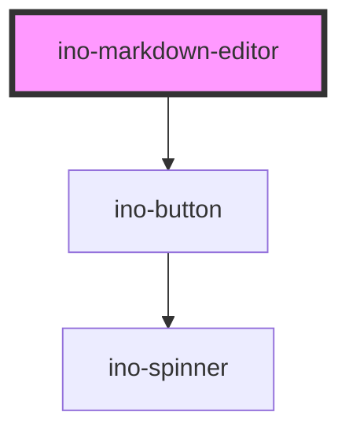

# ino-markdown-editor

<!-- Auto Generated Below -->

## Dependencies

### Depends on

- [ino-button](../ino-button)

### Graph

----------------------------------------------

*Built with [StencilJS](https://stenciljs.com/)*
