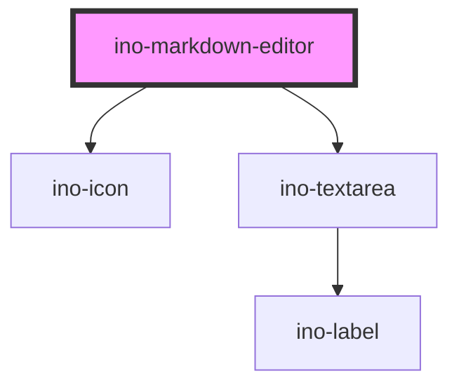

# ino-markdown-editor

<!-- Auto Generated Below -->

## Properties

| Property       | Attribute       | Description | Type                                    | Default            |
| -------------- | --------------- | ----------- | --------------------------------------- | ------------------ |
| `initialValue` | `initial-value` |             | `string`                                | `undefined`        |
| `viewMode`     | `view-mode`     |             | `ViewMode.MARKDOWN \| ViewMode.PREVIEW` | `ViewMode.PREVIEW` |

## Events

| Event            | Description | Type                                                 |
| ---------------- | ----------- | ---------------------------------------------------- |
| `valueChange`    |             | `CustomEvent<string>`                                |
| `viewModeChange` |             | `CustomEvent<ViewMode.MARKDOWN \| ViewMode.PREVIEW>` |

## Dependencies

### Depends on

- [ino-icon](../ino-icon)
- [ino-textarea](../ino-textarea)

### Graph

----------------------------------------------

*Built with [StencilJS](https://stenciljs.com/)*
